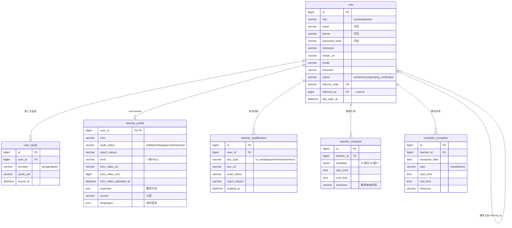
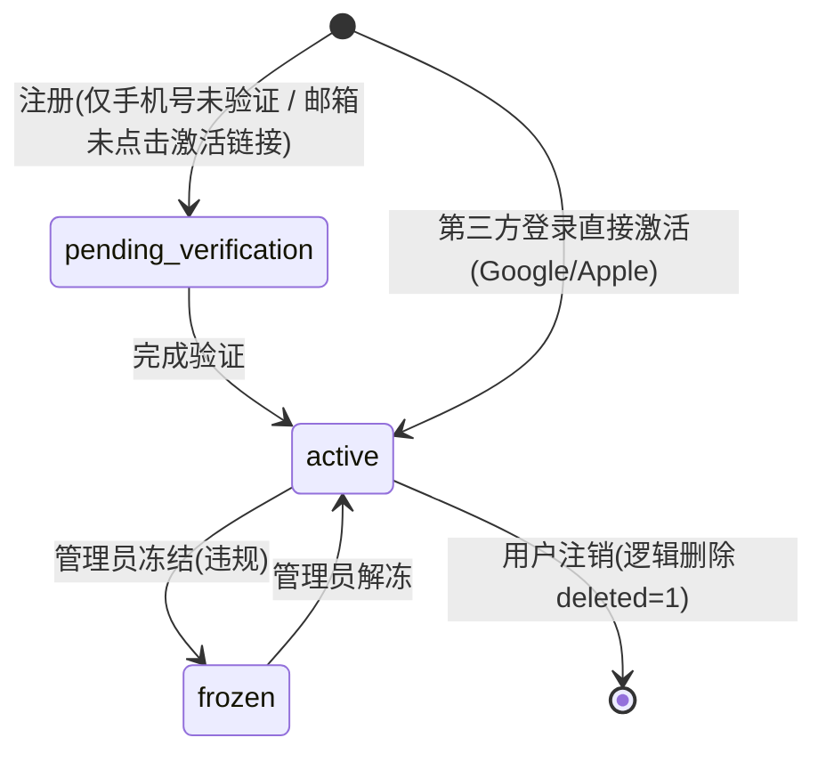
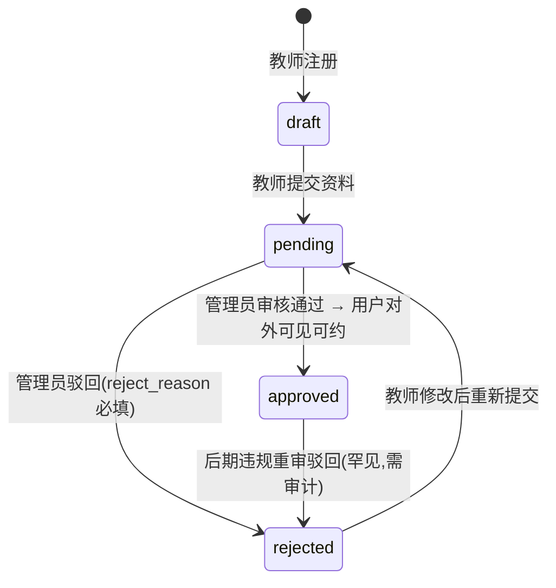

# 01 · 用户与认证

> **子域目标**:支撑学生 / 教师 C 端账号体系 + 4 种登录(邮箱 / 手机 / Google / Apple)+ 推荐关系 + 教师档案 / 资质 / 排课。
> **PRD 来源**:§4.1(U1–U5)+ §7「用户与认证」节
> **状态**:📝 设计稿 v1,待审

---

## 一、关键决策

### 1.1 与若依 `system_users` 关系:**分离**

| 维度 | `system_users`(若依沿用) | `user`(Mandarly 新建) |
|------|---|---|
| 用户群 | 管理后台 admin | C 端学生 + 教师 |
| 鉴权 | `SecurityConfiguration` admin-api | `SecurityConfiguration` app-api |
| 字段 | username / dept_id / post / 后台权限相关 | role / locale / timezone / referral_code / 业务字段 |
| 表前缀 | `system_*` | 无前缀 |

**理由**:角色 / 字段 / 鉴权完全不同,合表会让 `system_users` 长出大量 NULL 字段且污染若依框架的角色 / 部门 / 数据权限模型;分离后 admin 走若依原生流程,C 端独立设计,**互不干扰**。

> 后续若需要"同一个手机号同时是 admin 和 student",可在两张表用相同 `phone` 字段,Service 层手动关联,不强制单表。

### 1.2 角色:互斥(一期)

`user.role` 取值 `student` / `teacher`,**互斥**(一个账号同时只能是其一)。
- 一期 PRD 没有"同时是学生又是教师"的需求(对标 Cambly 也是分开账号)
- 后续若要支持混合身份:**新建 `user_role` 关联表**(多对多),迁移成本可接受

### 1.3 邮箱 / 手机号:**任一非空,可同时绑定**

- PRD-v4 §U1:同一账号可同时绑定邮箱 + 手机号,任一种均可登录
- 实现:`email` + `phone` 两个字段都允许 NULL,application 层校验"至少一个非空"
- 唯一索引:含 `deleted` 后缀,允许多 NULL(MySQL 行为)
- 第三方登录(Google / Apple)走独立的 `user_oauth` 关联表,**不**占用 `user.email` / `user.phone`

### 1.4 教师档案与资质:**分两张表**

- `teacher_profile`:与 `user` 1:1,放教师**整体**信息(自我介绍、视频、整体审核状态)
- `teacher_qualification`:与 `user` 1:n,放**多份**资质材料(身份证 / 教学证书等),每份独立审核

理由:整体状态和单份材料状态有不同生命周期(整体可能"审核通过"但某一份材料后期补传也要单独审)。

### 1.5 教师排课:**周时段 + 例外**

- `teacher_schedule`:每周可约时段(教师本地时区,**带 timezone 字段**)
- `schedule_exception`:单日临时变动(closed / extra)
- 预约时:Service 层按 `教师时区 + UTC 当前时间`算出该教师该天可约时段(并集 / 差集 schedule_exception),**不用在数据库做**

### 1.6 推荐码字段位置:**user 表内**

`user.referral_code`(自己的码) + `user.referred_by`(被谁推荐) — **存在 user 表**,不另建表(查询频繁)。
推荐关系链路 / 奖励状态另外走 `referral_record` 表(详见 § 05 子域)。

---

## 二、子域 ER 图



---

## 三、状态机

### 3.1 用户状态 `user.status`



### 3.2 教师审核状态 `teacher_profile.audit_status`



> 教师 `user.status=active` 是登录前提;额外要求 `teacher_profile.audit_status=approved` 才被学生检索到。
> **学生侧筛选条件**:`user.role='teacher' AND user.status='active' AND user.deleted=0 AND teacher_profile.audit_status='approved'`

### 3.3 资质审核状态 `teacher_qualification.audit_status`

资质材料上传后即进入 pending / approved / rejected,独立单份审核。

---

## 四、表结构详细

> ⚠️ 以下「字段」表只列业务字段,**不重复列通用字段**(`id` / `creator` / `create_time` / `updater` / `update_time` / `deleted` / `tenant_id`,见 README §2.2)。

---

### 4.1 `user` — 用户主表(学生 + 教师 C 端)

**用途**:Mandarly C 端用户主体,学生与教师共用一张表(role 区分)。

**字段**:

| 字段 | 类型 | 可空 | 默认 | 说明 |
|------|------|------|------|------|
| `role` | `VARCHAR(16)` | NO | — | `student` / `teacher`,互斥;一期不支持双角色 |
| `email` | `VARCHAR(128)` | YES | NULL | 邮箱;邮箱注册主键登录方式 |
| `email_verified_at` | `DATETIME` | YES | NULL | 邮箱验证时间;NULL 即未验证 |
| `phone` | `VARCHAR(32)` | YES | NULL | E.164 格式手机号(`+85291234567`)|
| `phone_verified_at` | `DATETIME` | YES | NULL | 手机号验证时间;NULL 即未验证 |
| `password_hash` | `VARCHAR(128)` | YES | NULL | BCrypt 哈希;手机号或第三方登录用户可为 NULL |
| `nickname` | `VARCHAR(64)` | NO | `''` | 昵称;注册时默认填邮箱前缀或手机后 4 位 |
| `avatar_url` | `VARCHAR(512)` | YES | NULL | 头像 URL,COS 路径或第三方头像 |
| `locale` | `VARCHAR(16)` | NO | `'en'` | 语言偏好:`en` / `zh-CN` / `zh-TW` / `ar`(对应 PRD §4.8) |
| `timezone` | `VARCHAR(64)` | NO | `'UTC'` | IANA 时区名,如 `Asia/Hong_Kong` |
| `status` | `VARCHAR(16)` | NO | `'pending_verification'` | 见 §3.1 状态机 |
| `referral_code` | `VARCHAR(16)` | NO | — | 自己的推荐码,注册时生成,如 `MAND2X8K` |
| `referred_by` | `BIGINT UNSIGNED` | YES | NULL | 被谁推荐的 user.id;首单立减 30 元用 |
| `learning_goal` | `VARCHAR(256)` | YES | NULL | 学生学习目标(自填,选填) |
| `last_login_at` | `DATETIME` | YES | NULL | 最近一次登录时间 |
| `last_login_ip` | `VARCHAR(64)` | YES | NULL | 最近登录 IP(防刷使用) |

**索引**:

| 索引 | 类型 | 字段 | 用途 |
|------|------|------|------|
| `PRIMARY` | 主键 | `id` | — |
| `uk_email_deleted` | UNIQUE | `(email, deleted)` | 邮箱唯一(逻辑删除考虑)|
| `uk_phone_deleted` | UNIQUE | `(phone, deleted)` | 手机号唯一 |
| `uk_referral_code` | UNIQUE | `referral_code` | 推荐码全局唯一 |
| `idx_role_status` | 普通 | `(role, status)` | 教师列表过滤主条件 |
| `idx_referred_by` | 普通 | `referred_by` | 反查"我推荐了多少人" |

**业务约束**:

1. `email` 与 `phone` 至少一个非空(application 层校验,DB 不强制以兼容第三方登录场景)
2. 仅邮箱注册用户必填 `password_hash`;手机号 / 第三方登录可为 NULL
3. `referral_code` 注册时生成 8 字符,字符集 `[A-Z0-9]`,以 `MAND` 开头(品牌前缀,共 8 字符如 `MANDXXXX`,**字段宽度 16 留余量**)
4. `email_verified_at` / `phone_verified_at` 为 NULL 时,登录走该方式应被拦
5. 教师 `role='teacher'` 时,**必须**同时存在 `teacher_profile` 行(Service 层注册流程保证)

**初始数据**:无(管理员账号走 `system_users`,不在此表)

---

### 4.2 `user_oauth` — 第三方登录绑定

**用途**:同一 user 可绑定多个第三方账号(Google + Apple);v4 决策一期仅 google / apple。

**字段**:

| 字段 | 类型 | 可空 | 默认 | 说明 |
|------|------|------|------|------|
| `user_id` | `BIGINT UNSIGNED` | NO | — | → `user.id` |
| `provider` | `VARCHAR(16)` | NO | — | `google` / `apple`(v4 一期);未来加 `wechat` / `alipay` 不改表结构 |
| `oauth_uid` | `VARCHAR(128)` | NO | — | 第三方平台返回的唯一 ID(Google `sub` / Apple `sub`)|
| `oauth_email` | `VARCHAR(128)` | YES | NULL | 第三方返回的邮箱(Apple Hide My Email 可能不同于 user.email)|
| `oauth_raw` | `JSON` | YES | NULL | 完整原始 payload(用户名 / 头像等),备审 |
| `bound_at` | `DATETIME` | NO | `CURRENT_TIMESTAMP` | 绑定时间 |
| `unbound_at` | `DATETIME` | YES | NULL | 解绑时间(NULL 表示当前生效)|

**索引**:

| 索引 | 类型 | 字段 | 用途 |
|------|------|------|------|
| `PRIMARY` | 主键 | `id` | — |
| `uk_provider_uid` | UNIQUE | `(provider, oauth_uid, deleted)` | 同一第三方账号只能绑定一个本站账号 |
| `idx_user_id` | 普通 | `user_id` | 反查"该用户绑了哪些"|

**业务约束**:

1. 解绑 = `unbound_at` 设值,**不**软删除;保留绑定历史以备风控查
2. 绑定流程:用户登录后从用户中心点"绑定 Google" → OAuth 回调 → 写本表

---

### 4.3 `teacher_profile` — 教师档案

**用途**:教师整体资料 + 视频简介 + 整体审核状态。与 `user` 1:1。

**字段**:

| 字段 | 类型 | 可空 | 默认 | 说明 |
|------|------|------|------|------|
| `user_id` | `BIGINT UNSIGNED` | NO | — | **主键**,= `user.id`(1:1)|
| `intro` | `VARCHAR(1024)` | YES | NULL | 文字自我介绍 |
| `audit_status` | `VARCHAR(16)` | NO | `'draft'` | 见 §3.2 |
| `reject_reason` | `VARCHAR(512)` | YES | NULL | 驳回原因(audit_status=rejected 时必填) |
| `audited_at` | `DATETIME` | YES | NULL | 最近一次审核时间 |
| `audited_by` | `BIGINT` | YES | NULL | 审核管理员 system_users.id |
| `level` | `VARCHAR(16)` | YES | NULL | 教师等级,**一期 NULL**,二期预留 Level1/2/3 差异化课时费 |
| `expertise` | `JSON` | YES | NULL | 教学方向数组,如 `["business","kids","HSK"]` |
| `accent` | `VARCHAR(32)` | YES | NULL | 口音标签:`mainland` / `taiwan` / `hk` / `mixed` |
| `languages` | `JSON` | YES | NULL | 教师会的语言列表,如 `["zh","en","ar"]` |
| `years_experience` | `INT` | YES | NULL | 教学年限 |
| `intro_video_url` | `VARCHAR(512)` | YES | NULL | 教师自我介绍视频(COS 路径,选填,v3.1 新增) |
| `intro_video_size` | `BIGINT` | YES | NULL | 视频文件大小 byte;后台限额 100MB(配置) |
| `intro_video_uploaded_at` | `DATETIME` | YES | NULL | 视频上传时间 |

**索引**:

| 索引 | 类型 | 字段 | 用途 |
|------|------|------|------|
| `PRIMARY` | 主键 | `user_id` | — |
| `idx_audit_status` | 普通 | `audit_status` | 后台审核列表过滤 |

**业务约束**:

1. **本表创建时机**:教师注册流程在写 `user` 时同步写空白 `teacher_profile`(audit_status=draft);教师显式提交审核后才转 `pending`
2. 视频字段(intro_video_*)三个一组,**要么三者全空,要么三者全有**(Service 层保证)
3. `audit_status=rejected` 时 `reject_reason` 必填,Service 层校验

---

### 4.4 `teacher_qualification` — 教师资质材料

**用途**:教师上传的多份资质(身份证 / 教学证书 / 经验证明),每份独立审核。

**字段**:

| 字段 | 类型 | 可空 | 默认 | 说明 |
|------|------|------|------|------|
| `user_id` | `BIGINT UNSIGNED` | NO | — | → `user.id` |
| `doc_type` | `VARCHAR(32)` | NO | — | `id_card`(身份证件,必填) / `passport`(护照,历史兼容) / `degree_cert`(学历证书,必填) / `teaching_cert`(教师资格证/教学证书,选填) / `english_cert`(英语四级或六级证书,选填) / `experience_proof`(经验证明,选填) |
| `doc_url` | `VARCHAR(512)` | NO | — | 文件 URL(COS) |
| `doc_filename` | `VARCHAR(128)` | YES | NULL | 原始文件名(展示用) |
| `audit_status` | `VARCHAR(16)` | NO | `'pending'` | pending/approved/rejected |
| `reject_reason` | `VARCHAR(512)` | YES | NULL | 驳回原因 |
| `audited_at` | `DATETIME` | YES | NULL | 审核时间 |
| `audited_by` | `BIGINT` | YES | NULL | 审核管理员 |

**索引**:

| 索引 | 类型 | 字段 | 用途 |
|------|------|------|------|
| `PRIMARY` | 主键 | `id` | — |
| `idx_user_doc` | 普通 | `(user_id, doc_type)` | 教师查自己提交的资质 |
| `idx_audit_status` | 普通 | `audit_status` | 后台待审列表 |

**业务约束**:

1. 同一用户同一 doc_type 可有**多份记录**(重新上传新版),`teacher_profile.audit_status` 综合判定看最新一份
2. 提交教师整体审核前必须至少存在 `id_card` + `degree_cert`;`teaching_cert`、`english_cert`、`experience_proof` 为选填
2. 资质材料文件**不**直接公开 URL,管理后台用 COS STS 临时签名访问

---

### 4.5 `teacher_schedule` — 教师每周可约时段

**用途**:教师设置每周固定可约时段,**按教师本地时区记录**。

**字段**:

| 字段 | 类型 | 可空 | 默认 | 说明 |
|------|------|------|------|------|
| `teacher_id` | `BIGINT UNSIGNED` | NO | — | → `user.id`,role 必为 teacher |
| `weekday` | `TINYINT` | NO | — | 0=周日 / 1=周一 / … / 6=周六(ISO 8601 周日为 0)|
| `start_time` | `TIME` | NO | — | 时段开始(教师本地时区)|
| `end_time` | `TIME` | NO | — | 时段结束;`end_time > start_time`(同日内,不跨日)|
| `timezone` | `VARCHAR(64)` | NO | — | 教师当时设置时段使用的时区,如 `Asia/Shanghai` |

**索引**:

| 索引 | 类型 | 字段 | 用途 |
|------|------|------|------|
| `PRIMARY` | 主键 | `id` | — |
| `idx_teacher_weekday` | 普通 | `(teacher_id, weekday)` | 学生预约查询 |

**业务约束**:

1. 每节课固定 30 分钟(PRD §10),时段长度建议 ≥ 30 分钟,`end_time - start_time` 必须能拆出整数节;Service 层切片
2. 同教师同 weekday 不同时段允许,**禁止重叠**,Service 层校验
3. 教师**改时区**(如搬家)时:不批量改本表,新建时段 + 删旧时段;`timezone` 字段是"该条记录设置时的时区快照"

---

### 4.6 `schedule_exception` — 时段例外

**用途**:教师单次特殊安排(临时不可约 / 临时新增可约)。

**字段**:

| 字段 | 类型 | 可空 | 默认 | 说明 |
|------|------|------|------|------|
| `teacher_id` | `BIGINT UNSIGNED` | NO | — | → `user.id` |
| `exception_date` | `DATE` | NO | — | 单日(教师时区下的日期)|
| `type` | `VARCHAR(16)` | NO | — | `closed`(临时不可约) / `extra`(临时新增) |
| `start_time` | `TIME` | YES | NULL | type=closed 时可空(整天不可约);type=extra 时必填 |
| `end_time` | `TIME` | YES | NULL | 同上 |
| `timezone` | `VARCHAR(64)` | NO | — | 该例外的时区(必须与 teacher_schedule 时区相符)|
| `reason` | `VARCHAR(256)` | YES | NULL | 备注(可选) |

**索引**:

| 索引 | 类型 | 字段 | 用途 |
|------|------|------|------|
| `PRIMARY` | 主键 | `id` | — |
| `idx_teacher_date` | 普通 | `(teacher_id, exception_date)` | 预约时按日查例外 |

**业务约束**:

1. `type='closed'` 且 start_time / end_time 都为空 → 整日不可约
2. `type='closed'` + start_time / end_time → 仅该时段不可约
3. `type='extra'` + start_time / end_time → 该日新增可约时段(此时教师本周原 schedule 不变)
4. **预约时段计算逻辑**(Service 层伪代码):
   ```
   slots = teacher_schedule(weekday)
        - schedule_exception(date, type=closed)
        + schedule_exception(date, type=extra)
   再过滤已被占用(course_order.status=upcoming) → 可约时段
   ```

---

## 五、迁移与初始化

- `user.referral_code` 生成器:Java 工具类,`MAND` + 4 位 `[A-Z0-9]` 随机,撞库重试
- 初始管理员**不在本表**,在 `system_users`;生产后台超管密码见 your local secret manager `Mandarly admin 后台超管账号`
- 测试数据:M2 阶段建一个 seed 脚本生成 10 个学生 + 5 个已审核教师,纯测试库用

---

## 六、设计决策(2026-05-05 定稿)

1. ✅ **教师审核通过后改资料**:`intro` 文字 + `intro_video` 改完**直接生效**,不重审(降低教师摩擦);管理员后台保留"下架"权限作为违规兜底。资质材料 `teacher_qualification` 永远独立走单份审核
2. ✅ **`user.password_hash` 长度 128**:沿用若依默认的 BCrypt(60 字符) + 余量;若未来切 Argon2id 再扩到 256
3. ✅ **`learning_goal` 一期自由文本**:不拆字典;二期若要"按学习目标筛选教师"再补字典 + `user_learning_tag` 关联表
4. ✅ **`expertise` / `languages` 一期 JSON**:不拆关联表;教师量 < 500 用 JSON `LIKE` 查询足够,过线后再迁移到 `teacher_expertise_tag` 关联表(接口层面无感切换)

---

## 七、跨子域接口

| 引用方 | 引用字段 | 来自 |
|---|---|---|
| `student_package.student_id` → `user.id` | 学生持有套餐 | § 02 |
| `course_order.student_id` / `teacher_id` → `user.id` | 订单买卖双方 | § 02 |
| `payment.user_id` → `user.id` | 支付主体 | § 03 |
| `teacher_income.teacher_id` → `user.id` | 教师收入 | § 04 |
| `teacher_balance.teacher_id` → `user.id`(PK) | 教师余额(1:1) | § 04 |
| `teacher_withdrawal.teacher_id` → `user.id` | 提现申请 | § 04 |
| `referral_record.referrer_id` / `referee_id` → `user.id` | 推荐链路 | § 05 |
| `notification.user_id` → `user.id` | 站内通知 | § 06 |
| `support_inquiry_log.user_id` → `user.id`(可空) | 客服咨询 | § 07 |
