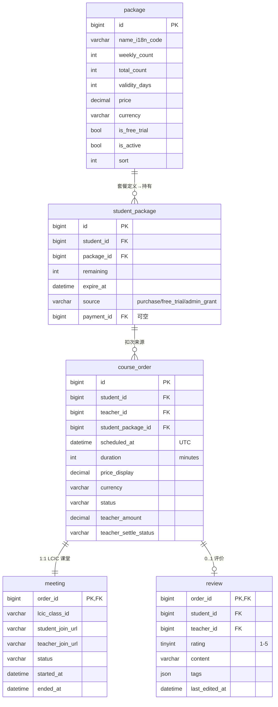
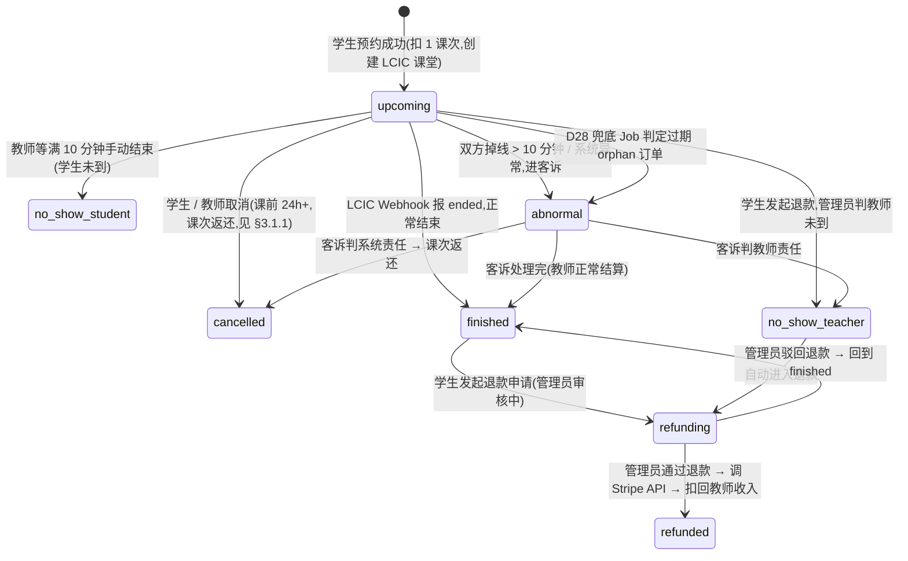
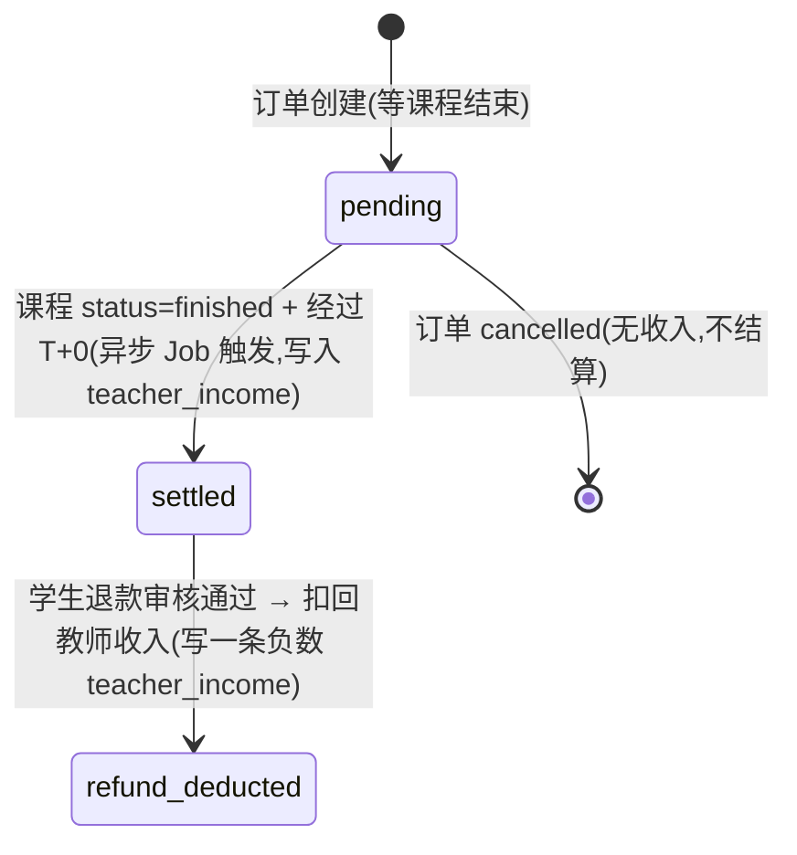
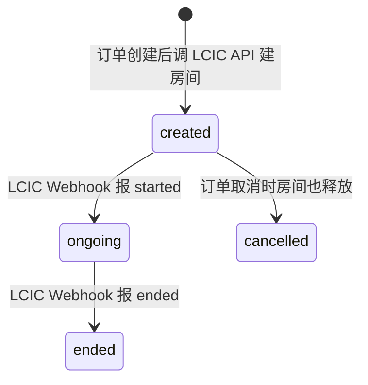

# 02 · 套餐与订单

> **子域目标**:套餐定义 + 学生持有的套餐实例 + 课程订单 + LCIC 课堂 + 学生评价
> **PRD 来源**:§4.3(S3 / S4 / S5 / S6 / S7)+ §4.6(LCIC) + §7「套餐与订单」节
> **状态**:✅ 定稿 v1.3(2026-05-24 补 active-upcoming 并发防重约束;2026-05-23 D28 补 `abnormal_reason` 自动诊断子类;2026-05-05 自审优化 + 主线确认:加 is_refunded_class / abnormal_resolution / review.tags 字典约束 / 跨日跨时区伪代码)

---

## 一、关键决策

### 1.1 表名 `course_order` 而非 `order`

`order` 是 MySQL 关键字,虽可用反引号但容易出 bug;改名 `course_order`,语义更明确(学员预约课程的订单,与"支付订单 payment"分离)。

### 1.2 套餐定义与持有 拆两张表

| 表 | 角色 |
|---|---|
| `package` | 平台**套餐定义**(增删改由管理员,后台 §A4)|
| `student_package` | 学生**持有的套餐实例**(剩余课次 / 有效期实例化记录)|

### 1.3 订单与支付 解耦

- `course_order` 表只记**单次预约课程**(扣 1 次套餐 / 扣免费体验课),**自身没有金额**(已经在 student_package 上预付)
- `payment` 表(详见 § 03)**只对应套餐购买**,与订单是间接关系(payment → student_package → course_order)
- 例外:免费体验课不走 payment

### 1.4 课时长度固定 30 分钟

PRD §10 确认:课时长度固定 30 分钟。`course_order.duration` 字段保留(单位分钟,默认 30),为将来扩展 60 分钟 / 45 分钟课预留,**一期写死 30**。

### 1.5 扣次优先级:免费体验课 > 即将过期套餐

学生预约时,Service 层判定:
1. 还有未用完的免费体验课?→ 优先扣
2. 否则,有多个套餐时,**优先扣"剩余有效期最短"的套餐**(避免到期作废)

### 1.6 `student_package.source` 字段必备

PRD §S3:学生套餐来源有 `purchase`(付费购买) / `free_trial`(注册赠送) / `admin_grant`(管理员后台手动发放,如客诉补偿)。

### 1.7 教师结算字段在订单上,不另起表

`course_order.teacher_amount` + `teacher_settle_status` 直接挂在订单,**结算流水**走 `teacher_income`(详见 § 04),关系是「订单 1:n 收入流水」(普通+扣回)。

### 1.8 课堂 `meeting` 表与订单 1:1

LCIC 课堂房间一个订单一个,不复用;课堂 ID + 师生进入 URL 单独存,Webhook 状态独立。

### 1.9 评价 `review` 1:1 订单

PRD §S7:每个完成订单**最多**一条评价;24h 可改;**编辑历史不存**(简化一期)。

---

## 二、子域 ER 图



---

## 三、状态机

### 3.1 订单状态 `course_order.status` ⭐(核心状态机)



#### 3.1.1 取消规则(PRD §S5,project owner确认)

| 取消时间 | 课次返还 | 退款 | 状态流转 | 字段标记 |
|---|---|---|---|---|
| 课前 24h+ | ✅ 全部返还(`student_package.remaining +1`)| ✅ 全额(若已支付套餐,**不在此场景**;此处仅扣次返还) | `upcoming → cancelled` | `is_refunded_class=1` |
| 课前 24h 内 / 缺席 | ❌ 不返还 | ❌ 不退 | `upcoming → cancelled`(原因记备注)| `is_refunded_class=0` |

> 注意:「取消」的退款 ≠ 「整个套餐退款」。套餐购买的退款走 §03 `refund` 表,与本表 status 弱相关。
>
> `is_refunded_class` 是**冗余字段**,目的是后续业务查询(教师无故缺席统计 / 学生取消率 / 退款审核扣回判定)能直接 WHERE 过滤,不需 JOIN 取消时间反算 24h 边界。Service 层在执行取消时根据"距 scheduled_at 是否 ≥ 24h"决定写 0 还是 1。

### 3.2 教师结算状态 `course_order.teacher_settle_status`



> **冻结期 T+7**(PRD §V4):课程完成后 7 个自然日内不可提现 — 这个不是订单状态,是 `teacher_balance.frozen` 余额计算逻辑(详见 § 04)。

### 3.3 课堂状态 `meeting.status`



---

## 四、表结构详细

> 通用字段(`id` / `creator` / `create_time` / 等)见 README §2.2,不再重述。

---

### 4.1 `package` — 套餐定义

**字段**:

| 字段 | 类型 | 可空 | 默认 | 说明 |
|------|------|------|------|------|
| `name_i18n_code` | `VARCHAR(64)` | NO | — | 多语言 key,关联 `i18n_message.code`,如 `package.name.half_year_1pw` |
| `weekly_count` | `INT` | YES | NULL | 每周课次,免费体验课 NULL |
| `total_count` | `INT` | NO | — | 总课次(免费体验课 = 1)|
| `validity_days` | `INT` | NO | — | 自购买起多少天有效,免费体验课如 30 天 |
| `price` | `DECIMAL(12,2)` | NO | `0.00` | 标价(单一币种,多市场定价二期再说)|
| `currency` | `VARCHAR(8)` | NO | `'HKD'` | 币种 |
| `is_free_trial` | `TINYINT(1)` | NO | `0` | 是否免费体验课;true 时自动赠送 |
| `is_active` | `TINYINT(1)` | NO | `1` | 上下架 |
| `sort` | `INT` | NO | `0` | 列表排序 |
| `description_i18n_code` | `VARCHAR(64)` | YES | NULL | 套餐描述多语言 key |

**索引**:

| 索引 | 字段 | 用途 |
|------|------|------|
| `PRIMARY` | `id` | — |
| `idx_active_sort` | `(is_active, sort)` | 学生端套餐列表 |

**初始数据**(M2 阶段 seed):

| name | weekly | total | validity | price | currency | is_free_trial |
|---|---|---|---|---|---|---|
| 免费体验课 | NULL | 1 | 30 | 0.00 | HKD | 1 |
| 半年包 1 节/周 | 1 | 26 | 180 | TBD | HKD | 0 |
| 半年包 2 节/周 | 2 | 52 | 180 | TBD | HKD | 0 |
| 一年包 1 节/周 | 1 | 52 | 365 | TBD(原价 9 折)| HKD | 0 |
| 一年包 2 节/周 | 2 | 104 | 365 | TBD(原价 9 折)| HKD | 0 |
| 单次试课 | NULL | 1 | 7 | TBD | HKD | 0 |

> 价格 TBD:project owner稍后提供(PRD §10 确认事项 #5),先 `0.00` 占位,A8 后台可改。

---

### 4.2 `student_package` — 学生持有的套餐实例

**字段**:

| 字段 | 类型 | 可空 | 默认 | 说明 |
|------|------|------|------|------|
| `student_id` | `BIGINT UNSIGNED` | NO | — | → `user.id`,role 必为 student |
| `package_id` | `BIGINT UNSIGNED` | NO | — | → `package.id` |
| `remaining` | `INT` | NO | — | 剩余课次,初始 = `package.total_count` |
| `expire_at` | `DATETIME` | NO | — | 失效时间(UTC),购买时刻 + `validity_days` |
| `source` | `VARCHAR(16)` | NO | — | `purchase` / `free_trial` / `admin_grant` |
| `payment_id` | `BIGINT UNSIGNED` | YES | NULL | → `payment.id`,免费 / 赠送类为 NULL |
| `granted_by` | `BIGINT` | YES | NULL | source=admin_grant 时 admin id;其他为 NULL |
| `granted_reason` | `VARCHAR(256)` | YES | NULL | source=admin_grant 时备注 |

**索引**:

| 索引 | 字段 | 用途 |
|------|------|------|
| `PRIMARY` | `id` | — |
| `idx_student_remaining_expire` | `(student_id, remaining, expire_at)` | 预约时按"有余量且未过期"查 |
| `idx_payment_id` | `payment_id` | 支付反查套餐 |

**业务约束**:

1. **同一学生可持多个 student_package**(并行),预约时按 §1.5 优先级扣
2. `remaining=0` 或 `expire_at < NOW()` 即作废,不参与扣次但保留历史记录
3. 套餐到期前 7/3/1 天提醒(走 §06 notification 表 + 定时 Job)
4. **退款扣回**:学生申请整个套餐退款时,`remaining` 不负化,直接 `is_active`(若加该字段)= 0;课次返还的不影响 `remaining`(预约时本来扣的就在课程订单)

---

### 4.3 `course_order` — 课程订单

**字段**:

| 字段 | 类型 | 可空 | 默认 | 说明 |
|------|------|------|------|------|
| `student_id` | `BIGINT UNSIGNED` | NO | — | → `user.id` |
| `teacher_id` | `BIGINT UNSIGNED` | NO | — | → `user.id`,role=teacher |
| `student_package_id` | `BIGINT UNSIGNED` | NO | — | → `student_package.id`,哪个套餐扣的次 |
| `scheduled_at` | `DATETIME(3)` | NO | — | **UTC** 上课开始时刻 |
| `duration` | `INT` | NO | `30` | 课时(分钟),一期固定 30 |
| `price_display` | `DECIMAL(12,2)` | NO | `0.00` | 单节展示价格(套餐分摊价 = package.price / total_count;免费课 = 0)|
| `currency` | `VARCHAR(8)` | NO | `'HKD'` | — |
| `status` | `VARCHAR(24)` | NO | `'upcoming'` | 见 §3.1 |
| `cancel_reason` | `VARCHAR(256)` | YES | NULL | 取消原因(管理员或学生填) |
| `abnormal_reason` | `VARCHAR(64)` | YES | NULL | D28 兜底 Job 自动诊断子类:`meeting_missing` / `meeting_ongoing_overdue` / `lcic_init_failed` / `lcic_no_attendance` / `meeting_cancelled_orphan` / `meeting_unknown_status`;仅 admin 客服端展示,不直接对学生/教师暴露 |
| `cancelled_by` | `VARCHAR(16)` | YES | NULL | `student` / `teacher` / `admin` / `system` |
| `cancelled_at` | `DATETIME` | YES | NULL | — |
| `is_refunded_class` | `TINYINT(1)` | NO | `0` | 取消时是否已返还课次(`1` = 已返还,通常课前 24h+ 取消;`0` = 未返还,通常 24h 内 / 缺席)— **避免单纯 status='cancelled' 区分不出两种取消**,见 §3.1.1 |
| `active_upcoming_key` | `TINYINT` generated | YES | NULL | D29 并发防重兜底列:`status='upcoming' AND deleted=0` 时生成 `1`,其他状态为 NULL;配合唯一索引只限制同一教师同一时段的活跃 upcoming 单 |
| `abnormal_resolution` | `VARCHAR(256)` | YES | NULL | abnormal 状态被管理员处置后的结论备注(如"已联系教师确认网络掉线,判系统责任,返还课次")|
| `abnormal_processed_by` | `BIGINT` | YES | NULL | 处置 abnormal 的管理员 system_users.id |
| `abnormal_processed_at` | `DATETIME` | YES | NULL | 处置时间 |
| `finished_at` | `DATETIME` | YES | NULL | LCIC Webhook 报 ended 时间 |
| `teacher_amount` | `DECIMAL(12,2)` | NO | `0.00` | 教师该节课收入(免费课 = 0,普通 = 配置课时费) |
| `teacher_amount_currency` | `VARCHAR(8)` | NO | `'USD'` | 教师收入币种;当前实现固定 `USD`,不跟随学生套餐币种 |
| `teacher_settle_status` | `VARCHAR(24)` | NO | `'pending'` | 见 §3.2 |
| `is_free_trial` | `TINYINT(1)` | NO | `0` | 冗余字段,标记是否免费体验课课次(便于报表)|

**索引**:

| 索引 | 字段 | 用途 |
|------|------|------|
| `PRIMARY` | `id` | — |
| `idx_student_status_scheduled` | `(student_id, status, scheduled_at)` | 学生订单中心查询 |
| `idx_teacher_status_scheduled` | `(teacher_id, status, scheduled_at)` | 教师订单中心 |
| `idx_teacher_settle_status` | `(teacher_id, teacher_settle_status)` | 结算 Job 扫单 |
| `idx_scheduled_at` | `scheduled_at` | 课前提醒 Job 扫单 |
| `idx_student_package_id` | `student_package_id` | 套餐反查订单 |
| `idx_status_refunded` | `(status, is_refunded_class)` | 报表"取消率 / 缺席率"按是否返还课次区分 |
| `uk_teacher_scheduled_active` | `(teacher_id, scheduled_at, active_upcoming_key)` UNIQUE | DB 兜底保证同一教师同一时间最多 1 个活跃 upcoming 单;非 upcoming 因 generated NULL 可保留历史多行 |

**业务约束**:

1. 创建订单 = 扣 `student_package.remaining -= 1` + 调 LCIC 建房间 + 写 `meeting` 行,**事务**
2. 取消订单 = `status='cancelled'` + 24h 外则 `student_package.remaining += 1`,**事务**
3. `scheduled_at` 必须落在教师的 `teacher_schedule` 时段内(Service 层校验,见 § 01 §4.6 末尾算法)
4. 同一教师同一时间只能有 1 个 `status='upcoming'` 订单。
   - **当前实现(2026-05-24)**:`BookingServiceImpl#createOrder` 先抢 Redis lock `booking:teacher-slot:{teacherId}:{scheduledAt}`(wait 5s / lease 30s),锁内再做 `(teacher_id, scheduled_at, status='upcoming')` 查重、扣套餐和插入订单。
   - **DB 兜底**:`active_upcoming_key` generated column + `uk_teacher_scheduled_active` 唯一索引只约束活跃 upcoming 单;`cancelled/finished/abnormal/no_show_*` 历史行生成 NULL,不影响同一时段历史留存。
   - **失败语义**:Redis 抢锁超时返回 `BOOKING_SLOT_LOCK_TIMEOUT`;DB 唯一键兜底命中时捕获 `DuplicateKeyException` 并返回 409,事务回滚套餐扣次。
5. **不允许跨日预约**:课时 30 分钟,`scheduled_at` + 30min 必须不跨日(**教师本地时区下**判定,非 UTC)
   - 关键:数据库存 UTC,但跨日判断必须在教师时区下做,避免边界 case bug
   - 伪代码:
     ```java
     ZoneId teacherZone = ZoneId.of(teacher.getTimezone());
     LocalDate startDate = scheduledAt.atZone(teacherZone).toLocalDate();
     LocalDate endDate   = scheduledAt.plusMinutes(duration).atZone(teacherZone).toLocalDate();
     if (!startDate.equals(endDate)) {
         throw new BusinessException("ORDER_CROSS_DAY_FORBIDDEN");
     }
     ```
   - 单测必含 case:① 教师 Asia/Shanghai 23:30 开始(UTC 15:30,本地不跨日 ✅)② 教师 America/New_York 23:45 开始 30min(本地跨日 ❌)③ 教师在 UTC 边界 0:00 前后(本地不跨日)
6. `teacher_amount` 在订单创建时**先按当时配置写入**,而不是结算时算 — 避免后台改了课时费影响历史订单
7. **abnormal 自动诊断 vs 人工结论**:`abnormal_reason` 由 D28 兜底 Job 自动写入,用于客服队列筛选;`abnormal_resolution` 是客服查实后的人工处置结论。
8. **abnormal 处置闭环**:`abnormal → finished/no_show_teacher/cancelled` 任一流转必填 `abnormal_resolution` + `abnormal_processed_by`,Service 层强约束

---

### 4.4 `meeting` — LCIC 课堂

**字段**:

| 字段 | 类型 | 可空 | 默认 | 说明 |
|------|------|------|------|------|
| `order_id` | `BIGINT UNSIGNED` | NO | — | **主键**,= `course_order.id`(1:1)|
| `lcic_class_id` | `VARCHAR(64)` | NO | — | LCIC 创建房间返回的 ID |
| `lcic_room_url` | `VARCHAR(512)` | YES | NULL | 通用房间 URL(若有)|
| `student_join_url` | `VARCHAR(512)` | YES | NULL | 学生进入 URL(含临时 token,有过期时间)|
| `teacher_join_url` | `VARCHAR(512)` | YES | NULL | 教师进入 URL |
| `student_token_expires_at` | `DATETIME` | YES | NULL | 学生 token 过期时间(课前 5 分钟生成,2 小时有效)|
| `teacher_token_expires_at` | `DATETIME` | YES | NULL | 教师 token 过期时间 |
| `status` | `VARCHAR(16)` | NO | `'created'` | 见 §3.3 |
| `started_at` | `DATETIME(3)` | YES | NULL | 学生 / 教师任一进入时间 |
| `ended_at` | `DATETIME(3)` | YES | NULL | LCIC 报结束时间 |
| `student_attended` | `TINYINT(1)` | YES | NULL | 是否学生进入过(LCIC Webhook 判定)|
| `teacher_attended` | `TINYINT(1)` | YES | NULL | 是否教师进入过 |

**索引**:

| 索引 | 字段 | 用途 |
|------|------|------|
| `PRIMARY` | `order_id` | — |
| `uk_lcic_class_id` | `lcic_class_id`(UNIQUE)| LCIC Webhook 反查订单 |
| `idx_status` | `status` | 异常监控 |

**业务约束**:

1. token 不入 git,但本表存(token 是 LCIC 限时凭证,泄漏几小时内无害)
2. token 过期需重新生成,前端"进入课堂"按钮按需调后端 refresh
3. LCIC Webhook 入站验签(用 LCIC 回调密钥),签错直接拒
4. `student_attended` / `teacher_attended` 是判定 no_show 的依据

---

### 4.5 `review` — 学生评价

**字段**:

| 字段 | 类型 | 可空 | 默认 | 说明 |
|------|------|------|------|------|
| `order_id` | `BIGINT UNSIGNED` | NO | — | **主键**,= `course_order.id`(1:1)|
| `student_id` | `BIGINT UNSIGNED` | NO | — | 冗余,便于反查"该学生发的评价" |
| `teacher_id` | `BIGINT UNSIGNED` | NO | — | 冗余,便于教师查"我收到的评价" |
| `rating` | `TINYINT` | NO | — | 1–5 |
| `content` | `VARCHAR(1024)` | YES | NULL | 文字评价 |
| `tags` | `JSON` | YES | NULL | 评价标签数组,如 `["patient","native_accent","good_pace"]`,**值必须来自 `platform_config.review.tag_dict` 白名单**(下方业务约束 5)|
| `last_edited_at` | `DATETIME` | NO | `CURRENT_TIMESTAMP` | 最近一次编辑(24h 内可改)|
| `is_visible` | `TINYINT(1)` | NO | `1` | 后台下架开关(违规评价管理员可隐藏)|

**索引**:

| 索引 | 字段 | 用途 |
|------|------|------|
| `PRIMARY` | `order_id` | — |
| `idx_teacher_rating` | `(teacher_id, rating, is_visible)` | 教师详情页评价分布 + 平均分 |
| `idx_student_id` | `student_id` | 学生查"我发的评价" |

**业务约束**:

1. 仅 `course_order.status='finished'` 才能评价
2. 提交评价后 24h 内允许改,过 24h 文档锁(Service 层校验 `last_edited_at + 24h < NOW()` 不允改)
3. 编辑历史**不存**(简化一期,二期需要再加 review_history 表)
4. **评价不可删除**,只能 `is_visible=0` 隐藏
5. **`tags` 取值受白名单约束**:Service 层提交时校验 `tags` 数组每个元素都在 `platform_config.review.tag_dict` 配置内,否则报错。字典示例:
   ```json
   {
     "patient":           {"i18n":"review.tag.patient",           "category":"positive"},
     "native_accent":     {"i18n":"review.tag.native_accent",     "category":"positive"},
     "good_pace":         {"i18n":"review.tag.good_pace",         "category":"positive"},
     "well_prepared":     {"i18n":"review.tag.well_prepared",     "category":"positive"},
     "audio_issue":       {"i18n":"review.tag.audio_issue",       "category":"negative"},
     "late":              {"i18n":"review.tag.late",              "category":"negative"}
   }
   ```
   后台 §A8 可后期添加新标签(改 platform_config 即可,无需改代码)

---

## 五、跨子域接口

| 引用方 | 引用字段 | 来自 |
|---|---|---|
| `student_package.payment_id` → `payment.id` | 套餐购买支付关联 | § 03 |
| `course_order.refund_id`(隐式)→ `refund.order_id` | 退款关联(物理上 `refund` 表反向引用 order) | § 03 |
| `course_order` → `teacher_income.order_id` | 教师结算依据 | § 04 |

---

## 六、设计决策(2026-05-05 定稿)

1. ✅ **`order` 表名 → `course_order`**:避 MySQL 关键字
2. ✅ **教师收入字段挂在订单上**:`teacher_amount` + `teacher_settle_status`,流水另走 § 04
3. ✅ **课时长度 30 分钟硬编码默认值**:字段保留扩展性
4. ✅ **`teacher_amount` 订单创建时写入**:不在结算时计算,避免历史订单受后台调价影响
5. ✅ **review 编辑历史不存**:一期简化,二期需要再加表
6. ✅ **取消语义用 `is_refunded_class` 冗余字段而非拆 status**(2026-05-05 优化):保留单一 `cancelled` 状态简洁,辨别"是否返还课次"用独立字段,业务报表 / 退款审核可直接 WHERE 过滤
7. ✅ **abnormal 状态加管理员处置追踪字段**(2026-05-05 优化):3 个字段 `abnormal_resolution` / `abnormal_processed_by` / `abnormal_processed_at` 强制闭环
8. ✅ **review.tags 受 platform_config 白名单约束**(2026-05-05 优化):避免前端任意填值,字典后台可加

---

## 七、未决项 / 留待审核

(无,所有关键决策已在第 1-6 节定稿)
