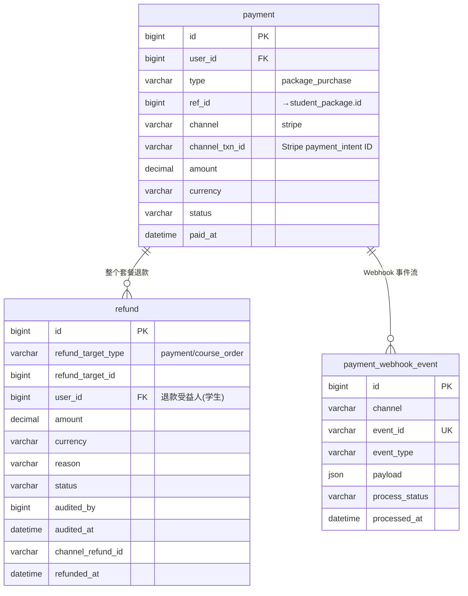
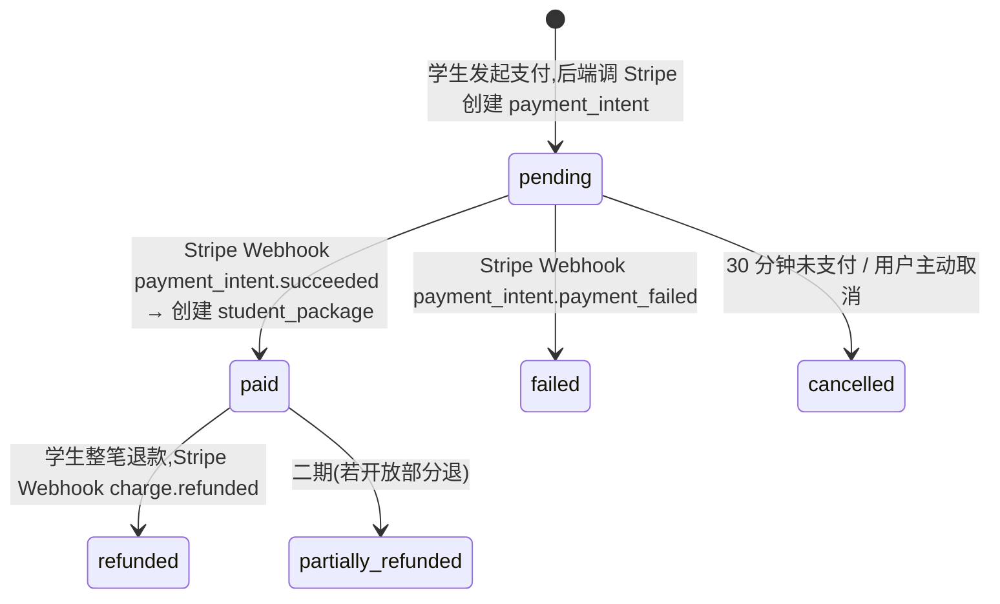
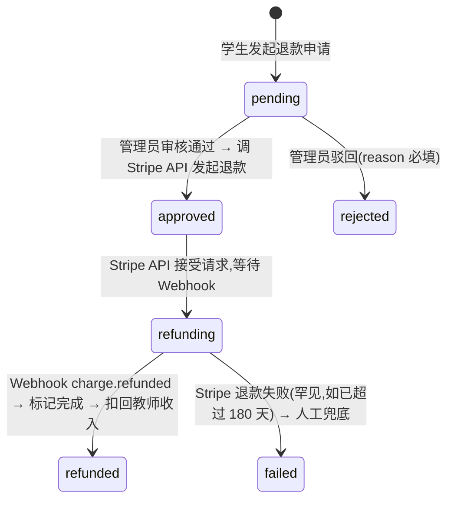
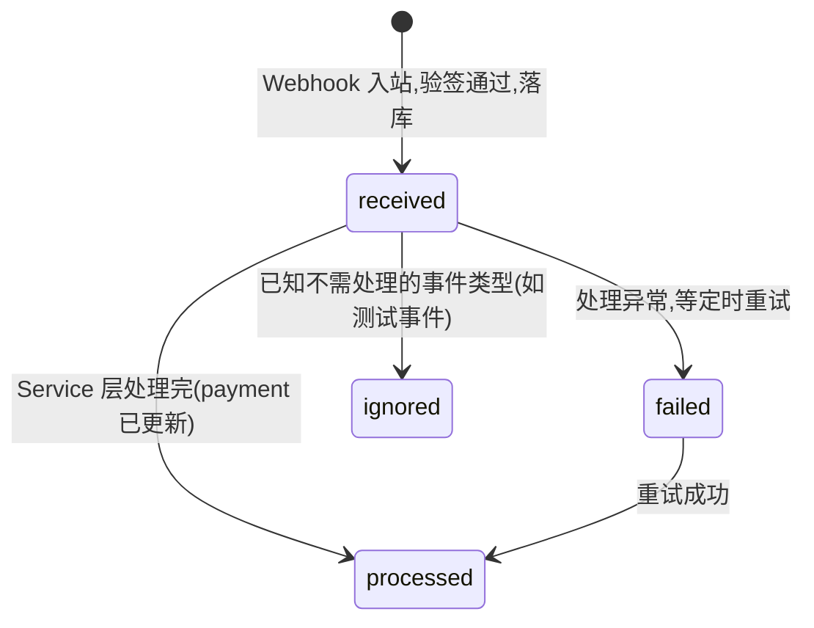

# 03 · 支付

> ⚠️⚠️⚠️ **本文档已废弃(2026-05-09 起作废)** ⚠️⚠️⚠️
>
> 本文档(v1.1, 2026-05-05)是 M4 启动**前**的早期方案探索,**不是当前 M4 实施依据**。
>
> **当前 M4 真实需求源 / 设计源**:
> - Spec: `docs/progress/m4-stripe-payment.md`(brainstorming 8 决策位 + reviewer Approved + 复核 5 项修订)
> - Plan: `docs/progress/m4-stripe-payment-plan.md`(双 reviewer 全链 Approved)
> - 复核报告: `docs/database/03-payment-review.md`(12 项中 5 必改 + 1 决策位已并入 M4 spec/plan)
>
> **关键差异**(本文档 vs 现行 M4):
>
> | 维度 | 本文档(老) | M4 现行 |
> |---|---|---|
> | webhook 表名 | `payment_webhook_event` | `stripe_event` |
> | 退款目标 | `refund_target_type` 双语义(payment / course_order) | 单一 payment(course_order 不直接退款,通过套餐扣回 teacher_income) |
> | ref_intent JSON schema | 复杂校验 | 简化:payment 表直接列 `discount_amount_usd` / `referrer_user_id` 字段 |
> | 接入模式 | 未定 | **Hosted Checkout**(spec 决策 1) |
> | 主货币 | HKD/USD/CNY 等价 | **USD 主** + Adaptive Pricing(spec 决策 6) |
> | Customer 映射 | 未提 | **加 user_payment_profile 表**(复核 #4 锁定) |
> | webhook 事件 | 4 个 | 10 个(加 dispute / fraud / processing 等) |
>
> **不要基于本文档实施**。业务需求看 `docs/product/prd-v4.md` §4.4;落地代码看 M4 spec / plan。

---

> **子域目标**:Stripe 支付通道接入 + 退款审核流转 + Webhook 事件落库
> **PRD 来源**:§4.4(P1 / P2 / P3) + §7「支付」节
> **状态**:❌ **已废弃 v1.1**(2026-05-05 自审优化 + 主线确认:ref_intent JSON schema 定型 + 金额校验 + payload 大小提示)— **2026-05-09 由 M4-Stripe支付.md spec 替代**

---

## 一、关键决策

### 1.1 唯一支付通道:Stripe

PRD §4.4 + 支付通道方案说明:Stripe 一个商户号统一支持 Visa / Mastercard / 微信 / 支付宝 / Apple Pay 等。**`channel` 字段一期只有 `stripe`**,但保留枚举设计便于二期扩展(如人工打款、其他通道)。

### 1.2 支付对象抽象:`type` + `ref_id`

`payment` 表的 `type` + `ref_id` 双字段表示"这笔支付是为了什么":

| `type` | `ref_id` 关联 | 一期是否启用 |
|---|---|---|
| `package_purchase` | → `student_package.id` | ✅ |
| `topup`(钱包充值)| → `wallet.id` | ❌ 二期 |
| `manual_grant`(人工到账,如线下转账)| 由备注说明 | ❌ 二期 |

### 1.3 退款 `refund` 表的「退什么」

退款有两种粒度,**用同一张表**,通过 `refund_target_type` + `refund_target_id` 区分:

| target_type | target_id 关联 | 场景 |
|---|---|---|
| `payment` | → `payment.id` | 学生申请整个套餐退款(原路退回 Stripe)|
| `course_order` | → `course_order.id` | 单节课的"退款扣回教师收入"(无原路退,只是结算扣减)|

### 1.4 Stripe Webhook 事件单独落库

不直接改 `payment.status`,先把 Webhook 事件原文落 `payment_webhook_event` 表(本子域第 3 张表),Service 层处理后再更 `payment.status`。**好处**:Webhook 重发幂等 + 可追溯。

### 1.5 多币种 + 汇率

PRD §P1:HKD / USD / CNY 三币种;用户购买页可切币种。

- `payment.currency` 记当时实际收款币种
- 汇率配置走 `platform_config`(详见 § 06),**不在本表**
- Stripe 自动处理多币种结算,后端只记币种 + 金额,无汇率换算逻辑

### 1.6 支付超时自动取消

PRD §P2:支付超时自动取消订单。一期实现:
- `payment.status='pending'` 持续 30 分钟未变 → 定时 Job 改 `status='cancelled'`
- 同时回滚 `student_package`(若已乐观创建)— 我们采取"**支付成功后才创建 student_package**"的策略,所以 pending 阶段没东西要回滚,简化逻辑

---

## 二、子域 ER 图



> 注:`refund` 与 `course_order` 也是 0..1 关系(单节课退款扣回),但通过 `refund_target_type='course_order'` + `refund_target_id` 引用,不画连线避免歧义。

---

## 三、状态机

### 3.1 支付状态 `payment.status`



### 3.2 退款状态 `refund.status`



### 3.3 Webhook 事件处理状态 `payment_webhook_event.process_status`



---

## 四、表结构详细

### 4.1 `payment` — 支付记录

**字段**:

| 字段 | 类型 | 可空 | 默认 | 说明 |
|------|------|------|------|------|
| `user_id` | `BIGINT UNSIGNED` | NO | — | → `user.id`,支付主体(学生)|
| `type` | `VARCHAR(32)` | NO | — | `package_purchase`(一期);二期扩展 `topup` |
| `ref_id` | `BIGINT UNSIGNED` | NO | — | type=package_purchase 时 → `student_package.id`(支付成功后创建) |
| `ref_intent` | `JSON` | YES | NULL | 创建支付时的"购买意向",支付成功后据此创建 student_package。**Schema 见下方业务约束 4** |
| `channel` | `VARCHAR(16)` | NO | `'stripe'` | 一期固定 stripe |
| `channel_txn_id` | `VARCHAR(128)` | YES | NULL | Stripe `payment_intent.id`(`pi_xxx`),发起后回填 |
| `channel_charge_id` | `VARCHAR(128)` | YES | NULL | Stripe `charge.id`(`ch_xxx`),Webhook 报 succeeded 时回填 |
| `amount` | `DECIMAL(12,2)` | NO | — | 实际收款金额 |
| `currency` | `VARCHAR(8)` | NO | — | 币种 |
| `status` | `VARCHAR(24)` | NO | `'pending'` | 见 §3.1 |
| `paid_at` | `DATETIME` | YES | NULL | 支付成功时间 |
| `failed_reason` | `VARCHAR(256)` | YES | NULL | failed 时填 Stripe 错误信息 |
| `cancelled_at` | `DATETIME` | YES | NULL | — |
| `expires_at` | `DATETIME` | NO | — | pending 超时时间(创建 + 30 分钟) |
| `client_ip` | `VARCHAR(64)` | YES | NULL | 风控 |
| `user_agent` | `VARCHAR(256)` | YES | NULL | 风控 |
| `metadata` | `JSON` | YES | NULL | 扩展字段(优惠券 / 推荐码使用记录 等)|

**索引**:

| 索引 | 字段 | 用途 |
|------|------|------|
| `PRIMARY` | `id` | — |
| `uk_channel_txn_id` | `(channel, channel_txn_id, deleted)` UNIQUE | Stripe 反查防重复 |
| `idx_user_status_created` | `(user_id, status, create_time)` | 学生支付历史 |
| `idx_status_expires_at` | `(status, expires_at)` | 超时取消 Job 扫单 |
| `idx_ref` | `(type, ref_id)` | 反查"该套餐是哪笔支付" |

**业务约束**:

1. **支付成功后才创建 `student_package`**:`ref_intent` 字段保存"购买意向",Webhook 报 succeeded 时事务内创建 student_package + 回填 `ref_id`
2. `channel_txn_id` 唯一,Webhook 重发用此字段幂等
3. `metadata.referral_code_used` 若有,触发推荐奖励逻辑(写入 §05 referral_record)
4. **`ref_intent` JSON Schema(强制结构,Service 层创建 payment 时校验)**:
   ```json
   {
     "package_id": 5,
     "quantity": 1,
     "expected_amount": "299.00",
     "expected_currency": "HKD",
     "referral_code_used": "MAND2X8K",
     "discount_amount": "30.00",
     "discount_currency": "HKD"
   }
   ```
   字段说明:
   - `package_id`(必填):购买的 `package.id`
   - `quantity`(必填):一期固定 1,二期支持批量购买时扩展
   - `expected_amount`(必填):前端展示给用户、用户确认的金额(字符串避免精度问题)
   - `expected_currency`(必填):币种,与 payment.currency 一致
   - `referral_code_used`(选填):推荐码,触发立减
   - `discount_amount` / `discount_currency`(referral 时必填):立减后金额 = expected_amount - discount_amount
5. **金额一致性强校验**:Webhook 报 succeeded 时,**必须**校验:
   ```
   payment.amount == ref_intent.expected_amount - ref_intent.discount_amount (默认 0)
   payment.currency == ref_intent.expected_currency
   ```
   不一致 → 标 payment.status='failed' + alert(防止前端篡改 / 价格漂移 / Stripe 异常)

---

### 4.2 `refund` — 退款记录

**字段**:

| 字段 | 类型 | 可空 | 默认 | 说明 |
|------|------|------|------|------|
| `refund_target_type` | `VARCHAR(16)` | NO | — | `payment`(整笔套餐退款) / `course_order`(单节课结算扣回) |
| `refund_target_id` | `BIGINT UNSIGNED` | NO | — | 关联的 payment.id 或 course_order.id |
| `user_id` | `BIGINT UNSIGNED` | NO | — | 退款受益人(学生)|
| `amount` | `DECIMAL(12,2)` | NO | — | 退款金额 |
| `currency` | `VARCHAR(8)` | NO | — | 币种 |
| `reason` | `VARCHAR(512)` | NO | — | 学生填的退款原因 |
| `status` | `VARCHAR(24)` | NO | `'pending'` | 见 §3.2 |
| `applied_at` | `DATETIME` | NO | `CURRENT_TIMESTAMP` | 学生申请时间 |
| `audited_by` | `BIGINT` | YES | NULL | 审核管理员 system_users.id |
| `audited_at` | `DATETIME` | YES | NULL | 审核时间 |
| `reject_reason` | `VARCHAR(512)` | YES | NULL | 管理员驳回原因 |
| `channel_refund_id` | `VARCHAR(128)` | YES | NULL | Stripe `refund.id`(`re_xxx`),仅 target=payment 时 |
| `refunded_at` | `DATETIME` | YES | NULL | Stripe 实际退款完成时间 |
| `teacher_income_deducted` | `TINYINT(1)` | NO | `0` | 是否已扣回教师收入(防止 Webhook 重复扣)|

**索引**:

| 索引 | 字段 | 用途 |
|------|------|------|
| `PRIMARY` | `id` | — |
| `idx_target` | `(refund_target_type, refund_target_id)` | 反查"该笔支付 / 订单的所有退款" |
| `idx_user_status` | `(user_id, status)` | 学生退款列表 |
| `idx_status_applied` | `(status, applied_at)` | 待审核列表 |

**业务约束**:

1. **同一 `refund_target_id` 同时只能有一条 pending / approved / refunding 状态的 refund**(防重复退,Service 层 + 唯一索引?这里用 Service 层乐观锁)
2. `refund_target_type='payment'` 时:Stripe API 真实扣款 → student_package 该订单关联的 remaining 不退(已经在订单 cancel 时处理过)
3. `refund_target_type='course_order'` 时:**仅扣回教师收入**(写一条负数 teacher_income),**不调 Stripe**(因为学生当时没单独支付这节课)
4. 教师收入扣回幂等性:用 `teacher_income_deducted=1` 标记,Webhook 重复触发只扣一次

---

### 4.3 `payment_webhook_event` — Stripe Webhook 事件流

**字段**:

| 字段 | 类型 | 可空 | 默认 | 说明 |
|------|------|------|------|------|
| `channel` | `VARCHAR(16)` | NO | `'stripe'` | Webhook 来源 |
| `event_id` | `VARCHAR(128)` | NO | — | Stripe `evt_xxx`(全局唯一)|
| `event_type` | `VARCHAR(64)` | NO | — | `payment_intent.succeeded` / `charge.refunded` / etc. |
| `payload` | `JSON` | NO | — | 完整 Webhook payload。Stripe 默认 < 32KB(够用 JSON 字段 64KB 限);若未来某事件类型超 64KB(如大 metadata),改 `MEDIUMTEXT`(16MB)或截断主体 + 完整原文存 COS,本表存 `payload_url` |
| `signature_verified` | `TINYINT(1)` | NO | `0` | 是否签名验证通过 |
| `process_status` | `VARCHAR(16)` | NO | `'received'` | 见 §3.3 |
| `process_attempt` | `INT` | NO | `0` | 处理尝试次数(失败重试用)|
| `processed_at` | `DATETIME` | YES | NULL | 处理完成时间 |
| `process_error` | `VARCHAR(1024)` | YES | NULL | 失败错误信息 |
| `related_payment_id` | `BIGINT UNSIGNED` | YES | NULL | 关联的 payment.id(如能从 payload 解出) |
| `related_refund_id` | `BIGINT UNSIGNED` | YES | NULL | 关联的 refund.id |

**索引**:

| 索引 | 字段 | 用途 |
|------|------|------|
| `PRIMARY` | `id` | — |
| `uk_event_id` | `event_id`(UNIQUE)| Webhook 幂等 |
| `idx_process_status` | `(process_status, create_time)` | 重试 Job 扫单 |
| `idx_event_type` | `event_type` | 按事件类型分析 |

**业务约束**:

1. Webhook 入站第一步:验签 → 落本表 → 返回 200 给 Stripe(**先 ACK 再处理**,避免 Stripe 重发风暴)
2. 异步 Service 拿 `process_status='received'` 的事件处理,处理完改 processed
3. 失败重试:`process_attempt < 5` 时,定时 Job 重新触发处理;超 5 次进 alert
4. 已知不处理事件类型(如 `customer.created`)直接置 `ignored`

---

## 五、跨子域接口

| 引用方 | 引用字段 | 来自 |
|---|---|---|
| `payment.user_id` → `user.id` | 支付主体 | § 01 |
| `payment.ref_id` → `student_package.id`(when type=package_purchase) | 套餐购买 | § 02 |
| `refund.refund_target_id` → `payment.id` 或 `course_order.id` | 退款对象 | 本子域 / § 02 |
| `refund` 触发 `teacher_income`(负数行) | 教师收入扣回 | § 04 |

---

## 六、设计决策(2026-05-05 定稿)

1. ✅ **唯一通道 Stripe**:`channel` 字段保留枚举设计,二期可扩
2. ✅ **支付对象抽象 `type` + `ref_id`**:为二期"钱包 / 充值"等留口子
3. ✅ **退款 `target_type` + `target_id`**:套餐退款 vs 单节课扣回 同表分流
4. ✅ **Webhook 事件单独落库**:幂等 + 可追溯,先 ACK 再处理
5. ✅ **支付成功后才创建 student_package**:用 `ref_intent` 暂存购买意向,避免 pending 期间脏数据
6. ✅ **超时 30 分钟自动取消**:定时 Job 扫 `(status, expires_at)` 索引
7. ✅ **`ref_intent` JSON Schema 强制定型**(2026-05-05 优化):8 字段固定结构 + 创建时 Service 层校验,避免不同开发人员各写各的格式
8. ✅ **Webhook succeeded 时强制金额一致性校验**(2026-05-05 优化):amount + currency 与 ref_intent 不符即 failed + alert,防篡改防漂移
9. ✅ **Webhook payload 大小预警**(2026-05-05 补注):JSON 64KB 上限,大 payload 走 COS 备份方案
