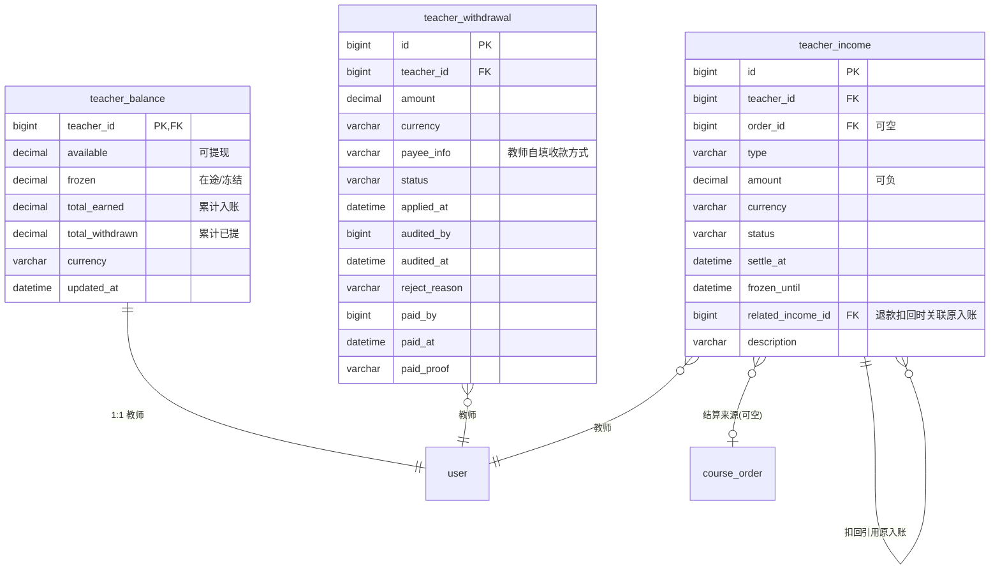
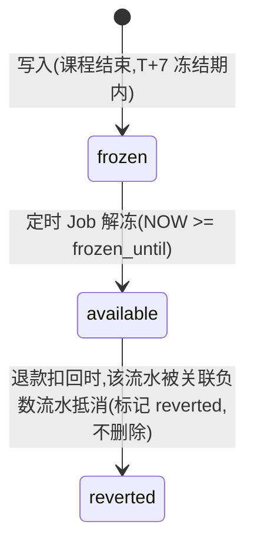
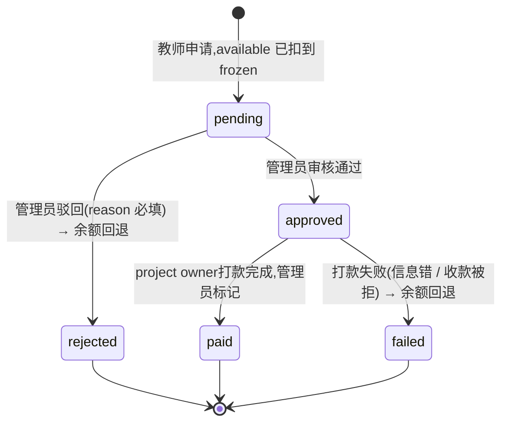

# 04 · 教师收入与提现

> **子域目标**:每节课的教师结算流水 + T+7 冻结期 / 余额管理 + 提现申请审核 / 人工打款全闭环
> **PRD 来源**:§4.5(V1 / V2 / V3 / V4) + §7「教师收入与提现」节
> **状态**:✅ 定稿 v1.2(2026-05-05 自审优化 + 主线确认:payee_info AES 加密 + frozen_until 语义明确)

---

## 一、关键决策

### 1.1 三表分工

| 表 | 角色 | 关系 |
|---|---|---|
| `teacher_income` | 收入**流水**(可正可负,每条可追溯到一个事件)| 1 教师 : n 流水 |
| `teacher_withdrawal` | 提现**申请单**(审核 + 打款全流程)| 1 教师 : n 申请 |
| `teacher_balance` | 教师**余额汇总**(快照,1:1)| 1 教师 : 1 行 |

> **`teacher_balance` 是"快照"还是"权威"**:权威。Service 层在写 `teacher_income` / `teacher_withdrawal` 时**事务内**同步更新 `teacher_balance`,避免每次查余额都聚合 income 全表(性能)。一致性靠 Service 层强约束 + 定期对账 Job 校验。

### 1.2 T+7 冻结期(PRD §V4)

课程完成后 7 个自然日内不可提现,**实现方式**:`teacher_income.frozen_until` 字段记解冻时刻。

- 写入时:`frozen_until = settle_at + 7 days`
- 余额计算:
  - `frozen` = SUM(amount) WHERE NOW() < frozen_until
  - `available` = total_earned - total_withdrawn - frozen
- 定时 Job(每小时)扫到 `frozen_until <= NOW()` 的流水 → 把对应金额从 frozen 挪到 available(即更新 `teacher_balance`)

### 1.3 收入流水类型 `type`

| `type` | 触发 | amount 正负 | 备注 |
|---|---|---|---|
| `normal` | 普通课程结算(`course_order.status=finished`)| 正 | 主流场景 |
| `free_trial` | 免费体验课(教师课时费 = 0,但仍写流水便于报表)| 0 或正 | 一期默认 0,可后台配置 |
| `refund_deduct` | 学生退款审核通过 → 扣回已结算收入 | **负** | 与原流水关联 `related_income_id` |
| `manual_adjust` | 管理员后台手动调整(客诉补偿 / 错算修正) | 正 / 负 | `description` 必填 |

### 1.4 提现采用人工打款(PRD §V4)

- 教师填收款信息(微信号 / 支付宝 / PayPal / 银行卡 等任意,自由文本字段 `payee_info`)
- 管理员审核通过后,**project owner私下打款** → 后台标记"已打款"
- **不**调任何支付通道 API(Stripe 不能反向打钱给随机收款方)
- 风险:打款失败 / 信息错时,管理员可标 `failed`,余额返还教师,教师重新申请

### 1.5 提现申请期间余额冻结(in-flight)

教师点"申请提现 X 元":
1. 校验 X ≤ available 余额
2. 写 `teacher_withdrawal` (status=pending,amount=X)
3. **事务内**:`teacher_balance.available -= X`,`teacher_balance.pending_withdraw += X`

驳回 / 审核失败:`available += X`,`pending_withdraw -= X`,流水**不写**(没有真正变动)。
打款成功:`pending_withdraw -= X`,`total_withdrawn += X`,**不写 income 流水**(income 是收入流水,提现不是收入)。

### 1.5.1 余额字段拆两个 frozen 类型(优化补充 2026-05-05)

> ⚠️ 原方案用单一 `frozen` 字段同时表达"T+7 未解冻"与"提现 in-flight",**语义混淆**会导致退款扣回 / 报表查询时分不清扣哪部分。优化为两个独立字段:

| 字段 | 含义 | 来源 |
|---|---|---|
| `frozen_t7` | 课程结算入账后 T+7 未解冻金额 | 来自 `teacher_income WHERE status='frozen' AND frozen_until > NOW()` |
| `pending_withdraw` | 提现申请 in-flight 冻结金额 | 来自 `teacher_withdrawal WHERE status IN (pending, approved)` |

不变量更新:
- `available + frozen_t7 + pending_withdraw = total_earned - total_withdrawn`

### 1.5.2 退款扣回的边缘 case(优化补充 2026-05-05)

学生退款审核通过 → 扣回教师收入,要看原 income 状态:

| 原 income 状态 | 扣回逻辑 |
|---|---|
| `available`(已解冻,正常情况)| `available -= X`,`total_earned -= X` |
| `frozen`(T+7 内退款)| `frozen_t7 -= X`,`total_earned -= X`(冻结期内的钱直接抵消,无需碰 available)|
| 已被提现的(罕见但可能,T+7 解冻 → 立刻提走 → 学生发起退款)| `available -= X`,**若 available 不够导致负数则报警 + 人工介入**(管理员后台手动调整 + 联系教师协商) |

> 实现:扣回 Service 方法接收 `income_id`,**先查原 income.status**,按上表分支处理。`teacher_income` 始终新增一行 `type='refund_deduct'`,原行标 `reverted`。

### 1.6 多币种处理(一期简化)

- 当前实现 `course_order.teacher_amount_currency` 固定 `USD`,与 `teacher_income.amount_usd` / `teacher_balance.*_usd` 保持一致
- 同一教师**所有收入同币种**(简化一期,不混币种)
- `teacher_balance.currency` 锁定(不允许中途改)
- 二期再考虑跨币种结算

### 1.7 最低提现额度 100 美元 / 等值(PRD §V4)

存在 `platform_config` 配置项 `min_withdrawal_amount`(按币种映射),Service 层校验。

### 1.8 教师收入字段挂在 `course_order` 上 vs 单独表

参考 § 02 §1.7 决策:**订单上写 `teacher_amount` + `teacher_settle_status`**(订单级状态),**`teacher_income` 是流水**(财务级)。两者职责不同,**都要保留**。

---

## 二、子域 ER 图



---

## 三、状态机

### 3.1 收入流水状态 `teacher_income.status`



> 状态字段保留语义,实际余额计算用 `teacher_balance` 直接读;`status` 字段供报表 / 审计用。

### 3.2 提现申请状态 `teacher_withdrawal.status` ⭐



**状态变更对余额的影响**(已对齐 §1.5.1 拆字段):

| 状态变更 | 操作 | available | pending_withdraw | total_withdrawn |
|---|---|---|---|---|
| `[*] → pending` | 教师申请 | -X | +X | — |
| `pending → approved` | 审核通过 | — | — | — |
| `approved → paid` | 打款完成 | — | -X | +X |
| `pending → rejected` | 驳回 | +X | -X | — |
| `approved → failed` | 打款失败 | +X | -X | — |

---

## 四、表结构详细

### 4.1 `teacher_income` — 收入流水

**字段**:

| 字段 | 类型 | 可空 | 默认 | 说明 |
|------|------|------|------|------|
| `teacher_id` | `BIGINT UNSIGNED` | NO | — | → `user.id` |
| `order_id` | `BIGINT UNSIGNED` | YES | NULL | → `course_order.id`,manual_adjust 时可空 |
| `type` | `VARCHAR(24)` | NO | — | 见 §1.3 |
| `amount` | `DECIMAL(12,2)` | NO | — | 可正可负;refund_deduct 必负 |
| `currency` | `VARCHAR(8)` | NO | — | 与教师 balance 同币种 |
| `status` | `VARCHAR(16)` | NO | `'frozen'` | frozen / available / reverted |
| `settle_at` | `DATETIME(3)` | NO | — | 入账时刻(对应课程 finished 时间)|
| `frozen_until` | `DATETIME(3)` | NO | — | 解冻时刻。**NOT NULL 强制写入**:`type=normal` 写 `settle_at + platform_config.withdrawal.frozen_days(默认 7d)`;`type=manual_adjust` / `refund_deduct` 写 `settle_at`(等同立即可用,语义"已无 T+7 限制");`type=free_trial` 与 normal 同处理 |
| `related_income_id` | `BIGINT UNSIGNED` | YES | NULL | refund_deduct 时,关联原 normal 流水 |
| `description` | `VARCHAR(256)` | YES | NULL | manual_adjust 必填,其他选填 |
| `created_by_admin` | `BIGINT` | YES | NULL | manual_adjust 时填管理员 id |

**索引**:

| 索引 | 字段 | 用途 |
|------|------|------|
| `PRIMARY` | `id` | — |
| `idx_teacher_settle` | `(teacher_id, settle_at)` | 教师收入明细按时间倒序 |
| `idx_teacher_status_frozen` | `(teacher_id, status, frozen_until)` | 解冻 Job 扫单 |
| `idx_order_id` | `order_id` | 反查订单的所有流水(主入账 + 扣回) |
| `idx_type` | `type` | 报表按类型聚合 |

**业务约束**:

1. **不允许直接 SQL UPDATE**,流水入账后只增不改(reverted 也只是状态变更)
2. `type='refund_deduct'` 时,`amount < 0` + `related_income_id` 必填
3. `frozen_until` 默认 `settle_at + 7 days`,但可由 `platform_config.settlement_frozen_days` 全局调整(写入时取当时配置)
4. **退款扣回逻辑**:
   ```
   1. 找到原 type=normal 的 income 行(原 amount=N)
   2. 写一行 type=refund_deduct, amount=-N, related_income_id=原 id, frozen_until=NOW()(立即生效)
   3. 原行 status=reverted
   4. 更新 teacher_balance:total_earned -= N,available 或 frozen -= N(看原行状态)
   ```
5. `free_trial` 流水即使 amount=0 也写,便于报表统计教师上课总数

---

### 4.2 `teacher_withdrawal` — 提现申请

**字段**:

| 字段 | 类型 | 可空 | 默认 | 说明 |
|------|------|------|------|------|
| `teacher_id` | `BIGINT UNSIGNED` | NO | — | → `user.id` |
| `amount` | `DECIMAL(12,2)` | NO | — | 申请金额 |
| `currency` | `VARCHAR(8)` | NO | — | — |
| `payee_info` | `VARCHAR(2048)` | NO | — | 教师填的收款信息(自由文本)。**🔐 落库前 AES-256-GCM 加密**(明文为银行卡号 / 微信号 / PayPal 等高敏 PII)。密文 Base64 编码膨胀约 33%,扩到 2048 |
| `payee_method` | `VARCHAR(32)` | YES | NULL | 收款方式枚举(可选,前端引导填):wechat / alipay / paypal / bank_card / other |
| `status` | `VARCHAR(16)` | NO | `'pending'` | 见 §3.2 |
| `applied_at` | `DATETIME` | NO | `CURRENT_TIMESTAMP` | 教师申请时间 |
| `audited_by` | `BIGINT` | YES | NULL | 审核管理员 system_users.id |
| `audited_at` | `DATETIME` | YES | NULL | — |
| `reject_reason` | `VARCHAR(512)` | YES | NULL | rejected 时必填 |
| `paid_by` | `BIGINT` | YES | NULL | 标记打款的管理员 id |
| `paid_at` | `DATETIME` | YES | NULL | — |
| `paid_proof` | `VARCHAR(512)` | YES | NULL | 打款凭证截图 URL(COS,选填,后台兜底)|
| `paid_remark` | `VARCHAR(256)` | YES | NULL | 打款备注 |

**索引**:

| 索引 | 字段 | 用途 |
|------|------|------|
| `PRIMARY` | `id` | — |
| `idx_teacher_status_applied` | `(teacher_id, status, applied_at)` | 教师查自己提现历史 |
| `idx_status_applied` | `(status, applied_at)` | 后台待审 / 待打款列表 |

**业务约束**:

1. 同一教师同时只能有 1 条 `pending` 或 `approved`(未打款)状态的申请,Service 层 + Redis 锁
2. 申请金额 ≥ `platform_config.min_withdrawal_amount`
3. 申请时事务内更新 `teacher_balance.available -= X` + `frozen += X`,失败回滚
4. **驳回 / 打款失败**返还余额时同样事务,**严禁余额漂浮**
5. **🔐 `payee_info` 加密策略**(高敏 PII,合规要求):
   - **算法**:AES-256-GCM(96-bit IV + 128-bit auth tag,IV 随机生成,Tag 与密文拼接)
   - **密钥**:`MANDARLY_PII_AES_KEY`(32 字节 Base64,存 `.env.local` + local secret manager and never commit it)
   - **实现**:MyBatis-Plus `@TableField(typeHandler = AesEncryptTypeHandler.class)`,DAO 层透明加解密;Service / Controller / 日志全部看到的是明文,数据库里是密文
   - **落地存储格式**:`{iv_base64}:{ciphertext_with_tag_base64}`(冒号分隔,便于密钥轮换识别)
   - **密钥轮换预案**:加 `kid`(key id)前缀 `v1:{iv}:{ct}`,新旧 key 同时存活解密;轮换 Job 异步重加密
   - **后台展示**:管理员查看提现申请时**只显示后 4 位**(如 "微信号:****1234"),完整明文需点"查看完整"按钮 + 二次确认 + 操作日志
   - **不索引 payee_info**(密文索引无意义);需查"教师 X 的提现历史"用 teacher_id 索引即可
   - **导出脱敏**:CSV / Excel 导出强制脱敏(后台代码层),禁导明文

---

### 4.3 `teacher_balance` — 教师余额汇总

**字段**(已按 §1.5.1 拆 frozen):

| 字段 | 类型 | 可空 | 默认 | 说明 |
|------|------|------|------|------|
| `teacher_id` | `BIGINT UNSIGNED` | NO | — | **主键**,= `user.id`(1:1)|
| `available` | `DECIMAL(12,2)` | NO | `0.00` | 可提现余额 |
| `frozen_t7` | `DECIMAL(12,2)` | NO | `0.00` | T+7 未解冻金额(来自 income.frozen_until > NOW)|
| `pending_withdraw` | `DECIMAL(12,2)` | NO | `0.00` | 提现申请 in-flight 冻结金额 |
| `total_earned` | `DECIMAL(12,2)` | NO | `0.00` | 累计入账(扣过 refund_deduct 的净值) |
| `total_withdrawn` | `DECIMAL(12,2)` | NO | `0.00` | 累计已打款金额 |
| `currency` | `VARCHAR(8)` | NO | `'HKD'` | 锁定币种 |
| `updated_at` | `DATETIME(3)` | NO | `CURRENT_TIMESTAMP ON UPDATE CURRENT_TIMESTAMP` | 最近更新 |
| `version` | `INT` | NO | `0` | 乐观锁,余额并发更新用 |

**索引**:

| 索引 | 字段 | 用途 |
|------|------|------|
| `PRIMARY` | `teacher_id` | — |

**业务约束**:

1. 教师注册时不立即创建本表行;**首次有收入流水时**懒创建(或注册后 Job 批量创建,二选一,推荐懒创建)
2. 余额变更**强制走 Service 层封装方法**(`addAvailable` / `freeze` / `unfreeze` / `withdraw`),禁止直接 UPDATE
3. **不变量**(每次变更后必须保持):
   - `available + frozen_t7 + pending_withdraw = total_earned - total_withdrawn`
   - `available >= 0` / `frozen_t7 >= 0` / `pending_withdraw >= 0`
4. **对账 Job**(每天凌晨,精确版):
   ```sql
   -- 期望累计入账 = 全部非 reverted 流水之和(refund_deduct 自身负数,SUM 自动抵消)
   SELECT SUM(amount) FROM teacher_income
     WHERE teacher_id = ? AND deleted = 0 AND status != 'reverted';
   -- 与 teacher_balance.total_earned + total_withdrawn 对比

   -- 期望 frozen_t7 = 当前 frozen 状态且未到解冻时间的流水
   SELECT SUM(amount) FROM teacher_income
     WHERE teacher_id = ? AND status = 'frozen' AND frozen_until > NOW();

   -- 期望 pending_withdraw = 进行中提现
   SELECT SUM(amount) FROM teacher_withdrawal
     WHERE teacher_id = ? AND status IN ('pending', 'approved');
   ```
   三处不一致 → alert + 人工对账
5. 乐观锁 `version` 防并发(写入时 `WHERE version = ?` + `version += 1`)
6. **解冻 Job 并发安全**:Job 扫到 frozen_until <= NOW 的流水,**逐 teacher 加 Redis 分布式锁**,避免与该教师同时申请提现的事务争用 `teacher_balance`

---

## 五、跨子域接口

| 引用方 | 引用字段 | 来自 |
|---|---|---|
| `teacher_income.teacher_id` → `user.id` | 教师 | § 01 |
| `teacher_income.order_id` → `course_order.id` | 结算来源 | § 02 |
| `teacher_balance.teacher_id` → `user.id`(PK)| 教师余额 1:1 | § 01 |
| `teacher_withdrawal.teacher_id` → `user.id` | 提现申请人 | § 01 |
| `refund` 触发 → 写 `teacher_income`(refund_deduct 行) | 退款扣回 | § 03 |

---

## 六、设计决策(2026-05-05 定稿)

1. ✅ **三表分工**:income 流水 / withdrawal 申请 / balance 快照;balance 是权威,Service 层强约束
2. ✅ **T+7 冻结**:用 `frozen_until` 字段实现,定时 Job 解冻
3. ✅ **多币种一期锁定单币种**:教师注册时定,中途不改
4. ✅ **提现纯人工打款**:不调 Stripe API,后台标记 paid / failed
5. ✅ **流水只增不改**:reverted 也只是状态变更;余额一致性靠对账 Job 校验
6. ✅ **`payee_info` 强制 AES-256-GCM 加密**(2026-05-05 优化,合规必需):typehandler 透明加解密 + 后台展示脱敏 + 导出脱敏 + 密钥可轮换
7. ✅ **`frozen_until` NOT NULL 强约束**(2026-05-05 优化):manual_adjust / refund_deduct 类型写 `=settle_at` 表"立即可用",**不允许 NULL**,避免余额计算逻辑分支
