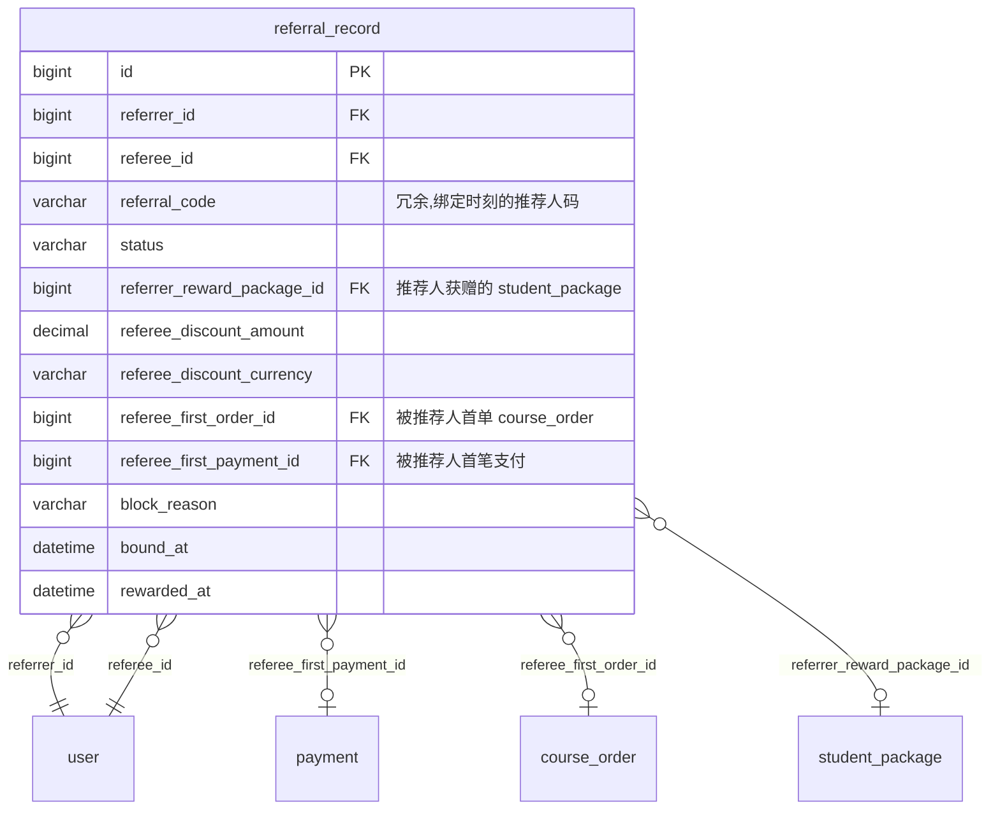
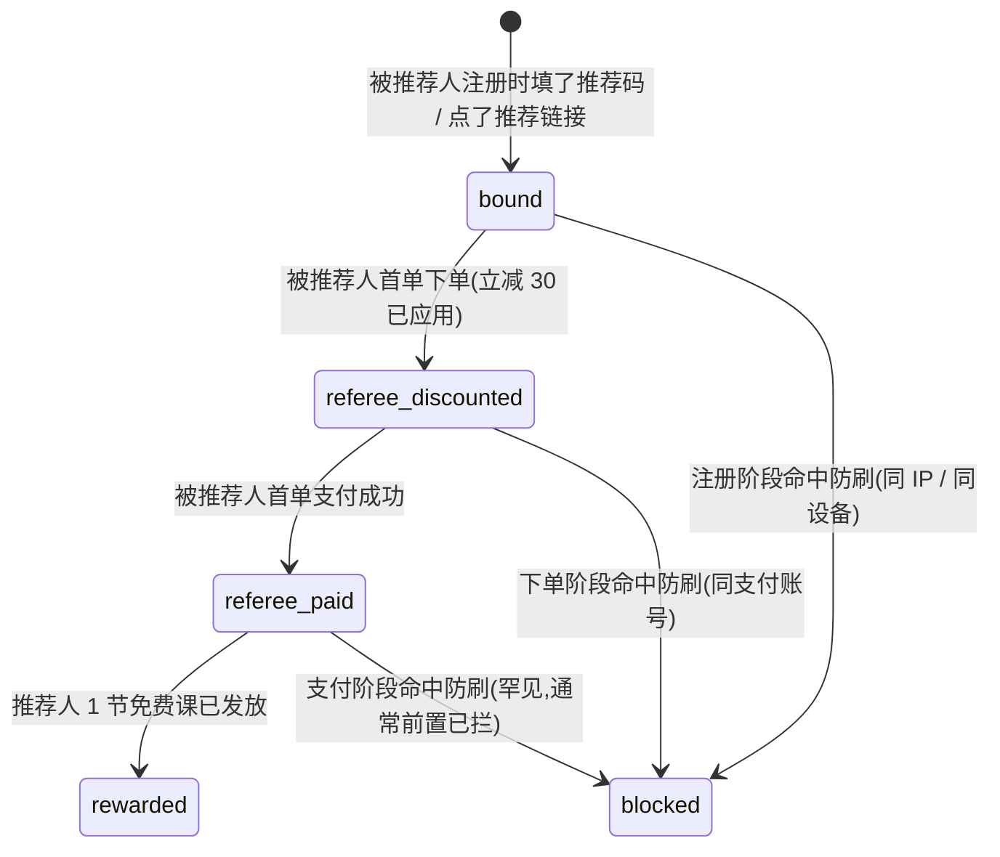

# 05 · 推荐码

> **子域目标**:推荐人 → 被推荐人关系记录 + 双向奖励状态追踪 + 防刷链路
> **PRD 来源**:§U4 + §A7 + §10 业务规则 #8 + §7「推荐码」节
> **状态**:✅ 定稿 v1.1(2026-05-05 自审优化 + 主线确认:referral_code 不可改约束 + ER 补 referral_record→payment 关系)

---

## 一、关键决策

### 1.1 推荐码本身在 `user` 表(已在 § 01 决策)

`user.referral_code` 自己的码 + `user.referred_by` 被谁推荐 — 在 § 01 已设计,本子域不重复。

### 1.2 本子域只一张表 `referral_record`

推荐**关系链路 + 奖励发放状态**追踪用,不冗余存推荐码本身(查时 JOIN user)。

### 1.3 奖励规则(PRD §10 #8 project owner确认,后台可调)

| 角色 | 奖励 | 触发时机 |
|---|---|---|
| 推荐人(referrer)| 1 节免费课(自动写入 student_package,source='admin_grant')| **被推荐人首单付费成功**时 |
| 被推荐人(referee)| 首单立减 30 元 | **被推荐人首次下单**时(支付前应用) |

> 推荐奖励金额 / 节数走 `platform_config`,后台可调:
> - `referral_reward_referrer_free_classes` = 1
> - `referral_reward_referee_discount_amount` = 30
> - `referral_reward_referee_discount_currency` = 'HKD'

### 1.4 防刷机制(PRD §U4)

PRD 明确:同 IP / 同设备 / 同支付账号限制。

实现:
1. **注册环节**(被推荐人注册时):记录 `register_ip` / `register_user_agent`(纳入 `user` 表的 `last_login_ip` 等字段;另外可加 `register_ip` 单独字段二期)
2. **下单环节**(被推荐人首单时):
   - 同 IP 24 小时内最多 1 次推荐奖励生效
   - 同支付账号(Stripe customer_id)最多 1 次
3. **关系永久绑定**:`referral_record` 写入后,`status` 仅在奖励发放时变化,**关系本身不改**
4. 命中防刷 → `referral_record.status='blocked'`,奖励不发,但记录留作审计

### 1.5 推荐链路深度

仅记录**直接推荐关系**(1 层),不做多层级 / 金字塔。

---

## 二、子域 ER 图



---

## 三、状态机

### 3.1 `referral_record.status`



> `bound` → `rewarded` 是黄金路径;blocked 是分支兜底。

---

## 四、表结构详细

### 4.1 `referral_record` — 推荐关系 + 奖励状态

**字段**:

| 字段 | 类型 | 可空 | 默认 | 说明 |
|------|------|------|------|------|
| `referrer_id` | `BIGINT UNSIGNED` | NO | — | 推荐人 → `user.id` |
| `referee_id` | `BIGINT UNSIGNED` | NO | — | 被推荐人 → `user.id` |
| `referral_code` | `VARCHAR(16)` | NO | — | 绑定时刻的推荐码(冗余,审计 / 推荐人改码后仍可查)|
| `status` | `VARCHAR(24)` | NO | `'bound'` | 见 §3.1 |
| `referrer_reward_package_id` | `BIGINT UNSIGNED` | YES | NULL | 推荐人获赠的 student_package.id;rewarded 状态时填 |
| `referee_discount_amount` | `DECIMAL(12,2)` | YES | NULL | 被推荐人立减金额(应用时填) |
| `referee_discount_currency` | `VARCHAR(8)` | YES | NULL | 立减币种 |
| `referee_first_order_id` | `BIGINT UNSIGNED` | YES | NULL | 被推荐人首单 course_order.id |
| `referee_first_payment_id` | `BIGINT UNSIGNED` | YES | NULL | 被推荐人首笔 payment.id |
| `block_reason` | `VARCHAR(256)` | YES | NULL | blocked 时填:`same_ip` / `same_device` / `same_payment_account` / `other` |
| `referrer_register_ip` | `VARCHAR(64)` | YES | NULL | 风控用:推荐人注册 IP |
| `referee_register_ip` | `VARCHAR(64)` | YES | NULL | 被推荐人注册 IP |
| `referee_device_fingerprint` | `VARCHAR(128)` | YES | NULL | 浏览器指纹(前端生成,选填) |
| `bound_at` | `DATETIME` | NO | `CURRENT_TIMESTAMP` | 关系绑定时间 |
| `referee_first_order_at` | `DATETIME` | YES | NULL | 首单时间 |
| `referee_first_paid_at` | `DATETIME` | YES | NULL | 首单支付成功时间 |
| `rewarded_at` | `DATETIME` | YES | NULL | 推荐人奖励发放时间 |

**索引**:

| 索引 | 字段 | 用途 |
|------|------|------|
| `PRIMARY` | `id` | — |
| `uk_referee_id` | `(referee_id, deleted)` UNIQUE | 一个用户只能被推荐一次(强约束) |
| `idx_referrer_status` | `(referrer_id, status)` | 推荐人查"我推荐了多少人,多少已成功" |
| `idx_status_bound_at` | `(status, bound_at)` | 后台分析 / 防刷 Job 扫描 |
| `idx_referee_register_ip` | `referee_register_ip` | 同 IP 防刷查询 |

**业务约束**:

1. **referee 唯一**:被推荐人只能被记录一次(uk_referee_id),后续即使再次输推荐码也不重复绑定
2. **referrer ≠ referee**:Service 层校验,自己不能推荐自己
3. **奖励发放幂等**:`rewarded_at` 非空时再次触发不重复发放(Service 层判定)
4. **风控前置**:绑定时直接判定 same_ip / same_device,命中即写 `status='blocked'`,不到 rewarded
5. **`user.referral_code` 一期不可改**:注册时由系统生成 `MAND` + 4 位随机字符,**用户侧无修改入口**;后台 §A7 仅可查不可改。即便未来开放修改,本表 `referral_code` 字段是绑定时的历史快照,不变更,确保推荐战绩可追溯
6. **推荐战绩查询**(PRD §S8 "我的推荐战绩"):
   ```sql
   SELECT
     COUNT(*) AS total_referred,
     SUM(status='rewarded') AS successful_count,
     SUM(referrer_reward_package_id IS NOT NULL) AS rewards_received
   FROM referral_record WHERE referrer_id = ? AND deleted = 0;
   ```

---

## 五、跨子域接口

| 引用方 | 引用字段 | 来自 |
|---|---|---|
| `referral_record.referrer_id` / `referee_id` → `user.id` | 推荐双方 | § 01 |
| `referral_record.referrer_reward_package_id` → `student_package.id` | 奖励包 | § 02 |
| `referral_record.referee_first_order_id` → `course_order.id` | 首单 | § 02 |
| `referral_record.referee_first_payment_id` → `payment.id` | 首付 | § 03 |
| `payment.metadata.referral_code_used` 触发本表 | 立减应用 | § 03 |

---

## 六、设计决策(2026-05-05 定稿)

1. ✅ **本子域单表**:链路记录 + 奖励状态 + 风控信息合并
2. ✅ **referee 唯一**:被推荐人只能被推荐 1 次,uk 强约束
3. ✅ **奖励规则后台可调**:写入 `platform_config`,Service 层取当时配置
4. ✅ **防刷状态化**:blocked 不删,留作审计
5. ✅ **不做多层级推荐**:一期仅 1 层直接关系
6. ✅ **`user.referral_code` 一期不可改**(2026-05-05 优化):用户侧无入口,后台只读;本表 referral_code 字段是绑定时快照,不变更
7. ✅ **ER 图补全 referral_record 与 payment / course_order / student_package 的关系连线**(2026-05-05 优化):便于阅读 + 业务理解
