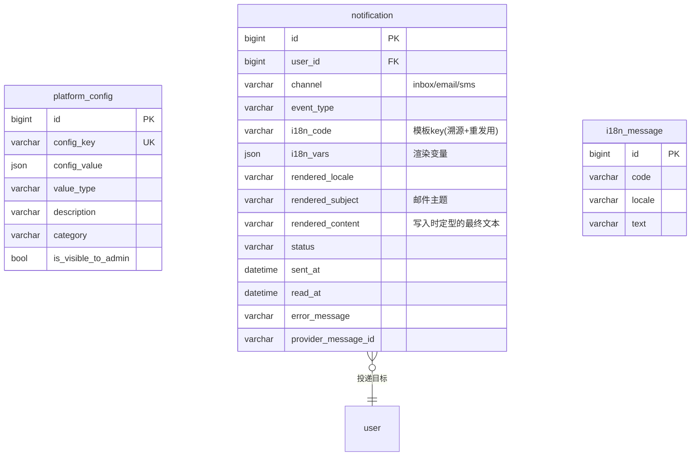

# 06 · 配置与通知

> **子域目标**:平台动态配置(可后台改) + 站内 / 邮件 / 短信通知投递记录 + 多语言文案库
> **PRD 来源**:§4.7(通知系统) + §A8(平台配置) + §4.8(多语言) + §7「配置 / 通知」节
> **状态**:✅ 定稿 v1.2(2026-05-05 自审优化 + 主线确认:notification 立刻渲染策略 + 失败重发按钮闭环)

---

## 一、关键决策

### 1.1 三表分工

| 表 | 角色 |
|---|---|
| `platform_config` | 键值对配置(JSON value),后台 §A8 可改 |
| `notification` | 通知投递记录(站内 / 邮件 / 短信三通道,统一表)|
| `i18n_message` | 多语言文案(code → locale → text)|

### 1.2 配置项命名 namespace 规范

为避免 platform_config 变成大杂烩,key 用点号 namespace:

- `pricing.class_unit_price.HKD` = 课时费(HKD)
- `pricing.free_trial_class_value` = 免费课课时费(默认 0)
- `withdrawal.min_amount.USD` = 最低提现额度
- `withdrawal.frozen_days` = T+7 冻结天数
- `referral.reward_referrer_free_classes` = 推荐人奖励课次
- `referral.reward_referee_discount_amount.HKD` = 被推荐人立减金额
- `cancel.full_refund_hours_before` = 取消全额退款的小时数(24)
- `support.faq_match_threshold` = FAQ 命中阈值(默认 0.3)
- `package.expire_reminder_days` = 套餐到期提醒提前天数 [7, 3, 1]
- `class.duration_minutes` = 课时长度(30)
- `currency.exchange_rates` = 汇率表(JSON)

### 1.3 通知统一表

PRD §4.7 通知矩阵涉及邮件 / 短信 / 站内信三通道。**一张表统一**,通过 `channel` 字段区分:

| `channel` | 投递实现 |
|---|---|
| `inbox` | 站内信,前端轮询 / WebSocket 推送 |
| `email` | 阿里云企业邮箱 SMTP |
| `sms` | 腾讯云 ISMS |

> 若同一事件要发多通道(如 PRD 矩阵里很多场景"邮件+短信+站内信"三个都要),**写 3 行**,各自独立追踪投递状态。

### 1.4 多语言 i18n_message 后端用,前端 vue-i18n 用 JSON 文件

- 后端文案(邮件 / 短信 / API 错误消息)走 `i18n_message` 表 + Spring `MessageSource`
- 前端 UI 文案走 `app/src/i18n/locales/*.js`(代码层维护)
- **不是同一份数据**,因为前端文案打包就走 webpack,改后台不会动前端;后端短信模板可后台编辑(PRD §A10 FAQ 也属于这类)

### 1.5 通知模板与正文

- **短信模板** = 腾讯云 ISMS 控制台模板(已建,见 `docs/operations/server-info.md` § 短信)
  - 后端只引用模板 ID + 传变量,**不存模板正文**
- **邮件模板** = RuoYi `system_mail_template` 作为可编辑 source of truth,后端通过 `MailSendApi` 传 `templateCode + templateParams` 渲染并发送 HTML。
  - 面向 C 端的业务邮件必须使用完整 HTML 文档(`<!doctype html><html><body...>`)而不是 fragment,对齐 `20260520_183000_polish_teacher_audit_mail_templates.sql` 的 Mandarly 品牌卡片:640px 白色卡片、`#fffaf0` 顶部品牌区、`#ffb627` CTA、隐藏 preheader、inline CSS。
  - 邮件标题统一以 `Mandarly - ...` 开头,避免 emoji / 符号标题在移动邮箱客户端出现空标题或异常截断。
  - 邮件页脚必须引用 `docs/compliance/company-entity.md` 的主体名和注册地址:`曼德勵科技有限公司 / MANDARLY TECHNOLOGY LIMITED`,地址 `RM 131, 1/F, 143 Wai Yip Street, Kwun Tong, Hong Kong`。
  - D21 收口 patch `20260524_171000_unify_brand_mail_template_footer.sql` 统一处理认证 / 支付 / 提现历史模板;生产执行后需清理 Redis `mail_template:*` 缓存并抽样真发复核。
  - 新增邮件模板 patch 必须列清 `params` JSON,并在 `ON DUPLICATE KEY UPDATE` 同步 `title/content/params/remark/updater/update_time`,便于重复执行修复生产缓存漂移。
- **站内信** = `notification.content`(JSON,含 i18n key + 变量),前端按 user.locale 实时渲染

### 1.6 通知投递状态独立追踪

每条 notification 记录投递状态;失败时记 `error_message`,后台可重发。

---

## 二、子域 ER 图

---

## 三、状态机

### 3.1 `notification.status`

```mermaid
stateDiagram-v2
    [*] --> pending: 业务触发,落库待发
    pending --> sent: 投递成功(SMTP / SMS / inbox 推送)
    pending --> failed: 投递失败,error_message 必填
    sent --> read: inbox 类被用户点击查看;email/sms 不维护此状态
    failed --> sent: 后台手动重发成功
```

---

## 四、表结构详细

### 4.1 `platform_config` — 平台配置

**字段**:

| 字段 | 类型 | 可空 | 默认 | 说明 |
|------|------|------|------|------|
| `config_key` | `VARCHAR(128)` | NO | — | 唯一键,点号 namespace,如 `pricing.class_unit_price.HKD` |
| `config_value` | `JSON` | NO | — | 值,JSON 类型支持任意结构(数字 / 字符串 / 数组 / 对象)|
| `value_type` | `VARCHAR(16)` | NO | `'string'` | 提示前端如何展示编辑器:`number` / `string` / `boolean` / `array` / `object` / `decimal` |
| `category` | `VARCHAR(32)` | NO | `'general'` | 分类:`pricing` / `withdrawal` / `referral` / `support` / `notification` / `general` |
| `description` | `VARCHAR(512)` | YES | NULL | 配置项说明(后台展示) |
| `is_visible_to_admin` | `TINYINT(1)` | NO | `1` | 是否在 §A8 后台可见(部分系统配置可隐藏)|
| `last_modified_by` | `BIGINT` | YES | NULL | 最后修改的管理员 system_users.id(审计字段,优化补充 2026-05-05)|
| `last_modified_reason` | `VARCHAR(256)` | YES | NULL | 修改原因备注(审计;改"课时费"等敏感配置时强制必填) |

**索引**:

| 索引 | 字段 | 用途 |
|------|------|------|
| `PRIMARY` | `id` | — |
| `uk_config_key` | `(config_key, deleted)` UNIQUE | — |
| `idx_category` | `category` | 后台分类筛选 |

**初始数据**(M2 阶段 seed,部分值待project owner提供):

| key | value | type | category | desc |
|---|---|---|---|---|
| `class.duration_minutes` | `30` | number | pricing | 课时长度,固定 30 |
| `pricing.class_unit_price.HKD` | `0` | decimal | pricing | 普通课课时费(HKD),待project owner提供 |
| `pricing.free_trial_class_value` | `0` | decimal | pricing | 免费课课时费 |
| `withdrawal.min_amount.USD` | `100` | decimal | withdrawal | 最低提现额度 |
| `withdrawal.frozen_days` | `7` | number | withdrawal | T+7 冻结期 |
| `referral.reward_referrer_free_classes` | `1` | number | referral | 推荐人奖励 |
| `referral.reward_referee_discount_amount.HKD` | `30` | decimal | referral | 被推荐人立减 |
| `cancel.full_refund_hours_before` | `24` | number | order | 取消全额退款时限 |
| `support.faq_match_threshold` | `0.3` | decimal | support | FAQ 命中阈值 |
| `package.expire_reminder_days` | `[7,3,1]` | array | notification | 到期提醒提前天数 |
| `currency.exchange_rates` | `{"USD_HKD":7.8,"CNY_HKD":1.08}` | object | pricing | 汇率表 |

**业务约束**:

1. 后端读配置走统一缓存层(Redis 5 分钟 TTL),避免 N 次 DB 查询
2. 后台改配置 → 失效 Redis 缓存 + 异步广播(若多实例,二期再考虑)
3. 数值类配置(money / 阈值)写入时严格类型校验,避免误输文字
4. **审计**:每次修改写入 `last_modified_by` + `update_time`(若依默认更新)+ 必要时 `last_modified_reason`
   - 高敏感分类(`pricing` / `withdrawal` / `referral`)修改时**强制要求填 reason**,Service 层校验
   - 完整变更历史走若依框架的 `infra_data_source_log`(若启用)或后续单独建 `platform_config_change_log`(暂不建,合规未要求时不超前设计)

---

### 4.2 `notification` — 通知投递记录

**字段**:

| 字段 | 类型 | 可空 | 默认 | 说明 |
|------|------|------|------|------|
| `user_id` | `BIGINT UNSIGNED` | NO | — | → `user.id`,投递目标 |
| `channel` | `VARCHAR(16)` | NO | — | `inbox` / `email` / `sms` |
| `event_type` | `VARCHAR(64)` | NO | — | `register_verify_code` / `package_purchased` / `class_reminder_30min` / `withdrawal_approved` etc. |
| `i18n_code` | `VARCHAR(128)` | NO | — | 模板 i18n key(用作溯源 + 重发时重渲染基础),如 `notification.class_reminder_30min` |
| `i18n_vars` | `JSON` | YES | NULL | 渲染变量,如 `{"teacher_name":"张老师","class_time":"2026-05-06 14:00 HKT"}` |
| `rendered_locale` | `VARCHAR(16)` | NO | — | 渲染时使用的 locale(写入时按 user.locale 决定) |
| `rendered_subject` | `VARCHAR(256)` | YES | NULL | 邮件主题 / 短信无 / inbox 标题(写入时定型,后期改 i18n_message 不影响) |
| `rendered_content` | `VARCHAR(2048)` | NO | — | **写入时按 user.locale 立刻渲染好的最终展示文本**;邮件正文 / 短信正文 / 站内信正文都直接读这个字段。**历史不变性**:i18n_message 后期修改不影响已发出通知 |
| `to_address` | `VARCHAR(256)` | YES | NULL | 邮件 = email 地址 / 短信 = E.164 手机号 / inbox NULL |
| `status` | `VARCHAR(16)` | NO | `'pending'` | 见 §3.1 |
| `sent_at` | `DATETIME` | YES | NULL | 投递成功时间 |
| `read_at` | `DATETIME` | YES | NULL | inbox 用户点击查看时间 |
| `error_message` | `VARCHAR(1024)` | YES | NULL | failed 时填 |
| `retry_count` | `INT` | NO | `0` | 失败重试次数 |
| `provider_message_id` | `VARCHAR(128)` | YES | NULL | 服务商返回 ID(腾讯云 SMS message_id / SMTP message_id) |
| `tpl_ref` | `VARCHAR(64)` | YES | NULL | 关联模板 ID(SMS 用腾讯云模板 ID) |

**索引**:

| 索引 | 字段 | 用途 |
|------|------|------|
| `PRIMARY` | `id` | — |
| `idx_user_channel_status` | `(user_id, channel, status, create_time)` | 用户站内信列表查询 |
| `idx_status_pending` | `(status, retry_count, create_time)` | 失败重发 Job |
| `idx_event_type_time` | `(event_type, create_time)` | 报表统计 |

**业务约束**:

1. 同一事件多通道发送 = 多行(每行独立追踪)
2. inbox 类:`status=sent` 即可,前端拉列表展示;`read_at` 是用户行为
3. 短信 `tpl_ref` 必填,关联腾讯云 ISMS 模板 ID
4. 失败重试上限 3 次,超 3 次进 alert 不再自动重试
5. 用户取消订阅 / 频次防骚扰由 Service 层判断(本表只记尝试)
6. **写入时立刻渲染策略**(2026-05-05 决策):
   - Service 创建 notification 行时**同步**调用 `MessageSource.getMessage(i18n_code, i18n_vars, user.locale)` 渲染出 `rendered_subject` / `rendered_content`
   - 站内信展示直接读 `rendered_content`,**不**延迟渲染(避免后期 i18n_message 改文案影响历史通知)
   - 短信发送时,正文用 `rendered_content`(实际短信走腾讯云 ISMS 模板,变量传 i18n_vars,本字段冗余存渲染结果便于审计)
   - 邮件主题用 `rendered_subject`,正文用 `rendered_content` 或基于 .ftl 模板二次渲染
7. **失败重发闭环**(2026-05-05 优化):
   - 自动重试 3 次后 status=failed,**不再自动**
   - 管理员后台 §A 通知管理页面:展示 `status=failed` 列表 + "重发"按钮 → 点击 → Service 重置 `retry_count=0` + `status=pending` + 触发异步发送
   - 重发使用**原 rendered_content**(不重新渲染,确保用户看到的内容与首次尝试一致)
   - 若需更换文案重发,后台支持"编辑后重发"动作:打开编辑 rendered_subject / rendered_content 对话框 → 保存 → 重发

---

### 4.3 `i18n_message` — 多语言文案(后端用)

**字段**:

| 字段 | 类型 | 可空 | 默认 | 说明 |
|------|------|------|------|------|
| `code` | `VARCHAR(128)` | NO | — | 文案 key,如 `email.welcome.subject` |
| `locale` | `VARCHAR(16)` | NO | — | `en` / `zh-CN` / `zh-TW` / `ar` |
| `text` | `TEXT` | NO | — | 实际文案,支持变量占位 `{var}` |
| `category` | `VARCHAR(32)` | YES | NULL | 分类:`email` / `sms` / `error` / `notification` |
| `description` | `VARCHAR(256)` | YES | NULL | 文案用途说明(后台展示)|

**索引**:

| 索引 | 字段 | 用途 |
|------|------|------|
| `PRIMARY` | `id` | — |
| `uk_code_locale` | `(code, locale, deleted)` UNIQUE | — |
| `idx_category` | `category` | 后台分类管理 |

**业务约束**:

1. 后端 `MessageSource` 启动时全量加载到内存,变更走 admin 后台编辑 + 触发 reload
2. 缺失某 locale 时回退优先级:`user.locale → en → zh-CN`
3. **前端 UI 文案不入此表**(走 `app/src/i18n/locales/*.js`),本表仅用于后端发出的内容(邮件 / 短信 / API 错误消息 / 站内信渲染)
4. **变量占位规范**:统一使用 **命名占位符 `{varName}`**(Spring 5+ `MessageSource` 通过 `MessageFormat` + named args 支持),示例:
   - 文案:`Your verification code is {code}, valid for {minutes} minutes.`
   - 调用:`messageSource.getMessage("sms.verify_code", Map.of("code","123456","minutes",5), locale)`
   - **禁止**位置占位 `{0}` `{1}`(顺序变更易出 bug)
   - 阿语等 RTL 语言的占位顺序可能与原文不同,**命名占位让翻译者自由调整位置**

---

## 五、跨子域接口

| 引用方 | 引用字段 | 来自 |
|---|---|---|
| `notification.user_id` → `user.id` | 投递目标 | § 01 |
| `platform_config` 全局被各子域 Service 读取(课时费 / 提现规则 / 推荐奖励 / 取消规则 等)| — | 全局 |
| `i18n_message.code` ← `notification.content.i18n_code` | 渲染依据 | 本子域 |

---

## 六、设计决策(2026-05-05 定稿)

1. ✅ **三表分工**:配置 / 通知 / 多语言互独立
2. ✅ **配置 key 点号 namespace**:避免大杂烩
3. ✅ **通知一张表统一三通道**:channel 字段区分,多通道发送 = 多行
4. ✅ **i18n_message 仅后端用**:前端 UI 文案走代码层,不重复
5. ✅ **配置缓存走 Redis 5min TTL**:不强一致,改完最多延迟 5 分钟生效
6. ✅ **notification 写入时立刻渲染**(2026-05-05 优化):rendered_subject / rendered_content 写死在表里,后期改文案不影响历史通知;重发时不重渲染
7. ✅ **失败重发后台闭环**(2026-05-05 优化):管理员后台通知管理页 + 重发按钮,可选"编辑后重发"
8. ✅ **platform_config 高敏感分类强制填修改原因**(2026-05-05 优化):pricing / withdrawal / referral 改时 last_modified_reason 必填
