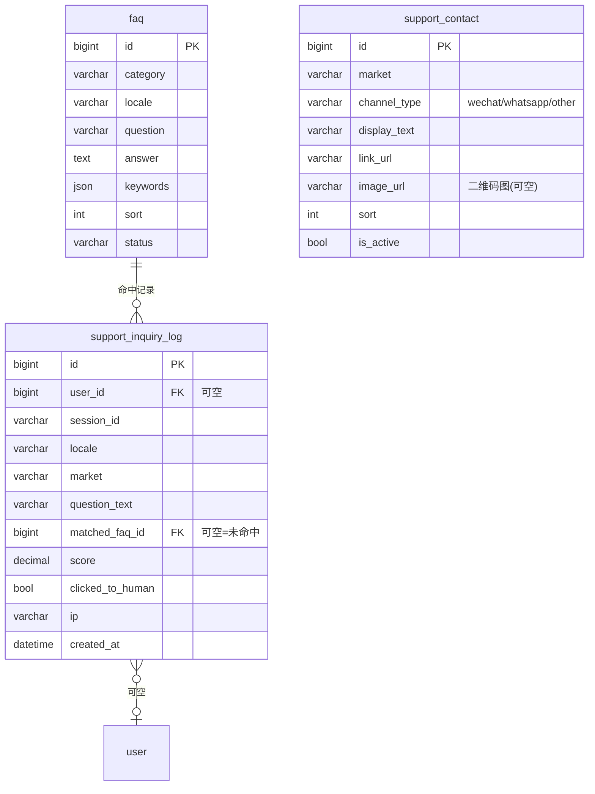

# 07 · 客服(v4 新增)

> **子域目标**:FAQ 库 + 关键字匹配引擎 + 私域引流入口 + 咨询日志(数据反馈闭环)
> **PRD 来源**:§4.12(C1–C8) + §A10 / §A11 / §A12 + §7「客服」节
> **状态**:✅ Phase 1 + admin §A10/A11/A12 代码完成(2026-05-13:公开客服 API + app 悬浮客服窗口 + FAQ seed + 咨询日志 + admin 运营闭环;2026-05-18 D15-B prod cutover `v20260518-d15b-cutover`)
>
> **范围收敛(2026-05-14 D15-A 产品决策)**:Phase 1 用户端 `SupportChatWidget` 只做"右下角 icon + 三渠道直引私域(微信/WhatsApp/Email)",**不做 FAQ 聊天 UI**。后端 ask 接口与关键字匹配引擎已实现并保留,作为 §C8 二期升级缓冲(接 LLM / 接在线人工时直接复用)。

---

## 一、关键决策

### 1.1 一期 = 关键字 + FAQ 匹配引擎,不接 LLM

PRD §4.12 明确:**不接入大模型**,后端 Java 内存计算关键字匹配。二期可平滑升级到 LLM,**接口不变**。

### 1.2 三表分工

| 表 | 角色 |
|---|---|
| `faq` | FAQ 库,关键字 + 答案,后台 §A10 管理 |
| `support_contact` | 私域联系方式按 market(地区)配,§A11 |
| `support_inquiry_log` | 咨询日志,每次提问留痕,数据反馈闭环 §A12 |

### 1.3 FAQ 仅按 `locale` 区分,不按 market

PRD §C2 明确:**FAQ 仅按语言(locale)区分**。差异化的私域联系方式独立配置(§C4)。Phase 1 查询顺序为 `requested locale → en → zh-CN`,避免某语言 FAQ 未配置时直接无答案。

### 1.4 私域 `support_contact` 按 market 区分

PRD §C4:
- 大陆 user.market=CN → 微信 / 企业微信
- 海外 → WhatsApp 链接
- 一期 user 表**没有** market 字段(§4.10 一期不实现);本表的 market 字段做"运营时根据用户 IP / locale 路由"逻辑用,**前端选 contact 时按 IP 国家 / locale 推断 market**。

### 1.5 咨询日志支持未登录用户(PRD §C6)

`support_inquiry_log.user_id` **可空**;用浏览器生成的 `session_id` (localStorage) 兜底。

### 1.6 关键字匹配性能

PRD §C2:几百条 FAQ × 字符串运算,**纯内存 < 10ms**。Phase 1 使用 Java 直接查 active FAQ 后内存打分:
- keywords 任一命中累计 `1 / keywords.size`
- question 与用户问题双向包含加 `0.500`
- 2/3-gram overlap 加权 `0.300`
- 总分 capped 到 `1.000`,阈值由 `infra_config.support.faq_match_threshold` 控制,默认 `0.300`

FAQ 缓存、后台改 FAQ 后失效缓存与广播留到 admin §A10 实现时补。

### 1.7 频率限制(PRD §C2)

同一 session_id 每分钟最多 30 条提问,Redis 计数器实现(不在数据库层)。

---

## 二、子域 ER 图

---

## 三、表结构详细

### 3.1 `faq` — FAQ 库

**字段**:

| 字段 | 类型 | 可空 | 默认 | 说明 |
|------|------|------|------|------|
| `category` | `VARCHAR(32)` | NO | — | `account` / `package` / `class` / `refund` / `teacher` / `other` |
| `locale` | `VARCHAR(16)` | NO | — | `en` / `zh-CN` / `zh-TW` / `ar` |
| `question` | `VARCHAR(512)` | NO | — | 问题 |
| `answer` | `TEXT` | NO | — | 答案,支持简单 Markdown(链接 / 加粗 / 列表),禁内嵌图片 |
| `keywords` | `JSON` | YES | NULL | 关键字数组,可空 → 仅靠 question LIKE + ngram 匹配 |
| `sort` | `INT` | NO | `0` | 同 category + locale 内排序(独立 FAQ 公开页用)|
| `status` | `VARCHAR(16)` | NO | `'active'` | active / disabled |
| `view_count` | `BIGINT` | NO | `0` | 独立 FAQ 页浏览次数(SEO 数据)|
| `match_count` | `BIGINT` | NO | `0` | 命中匹配次数(冗余,异步聚合自 inquiry_log) |

**索引**:

| 索引 | 字段 | 用途 |
|------|------|------|
| `PRIMARY` | `id` | — |
| `idx_locale_category_status_sort` | `(locale, category, status, sort)` | FAQ 公开页 |
| `idx_status` | `status` | 后台筛选 |

**业务约束**:

1. 同一 `category` 同一 `locale` 同一 `question` 不允许重复(应用层校验)
2. 答案 Markdown 渲染白名单:`a / strong / em / ul / ol / li / p / br`,其他 tag 转义
3. 删除 = `status='disabled'`(不真删,保历史 inquiry_log 关联)

---

### 3.2 `support_contact` — 私域联系方式

**字段**:

| 字段 | 类型 | 可空 | 默认 | 说明 |
|------|------|------|------|------|
| `market` | `VARCHAR(16)` | NO | `'DEFAULT'` | 地区代码:`CN` / `AE` / `HK` / `SG` / `US` / `DEFAULT`(兜底)|
| `channel_type` | `VARCHAR(16)` | NO | — | `wechat` / `whatsapp` / `other` |
| `display_text` | `VARCHAR(128)` | NO | — | 按钮 / 文案,如 "扫码加微信客服" |
| `link_url` | `VARCHAR(512)` | YES | NULL | 外链(如 `wa.me/86xxxx`);WeChat 可用 `wechat:<id>` 约定,用户端点击复制微信号 |
| `image_url` | `VARCHAR(512)` | YES | NULL | 二维码图 URL(COS),WeChat 优先用 |
| `sort` | `INT` | NO | `0` | 同 market 内排序 |
| `is_active` | `TINYINT(1)` | NO | `1` | — |

**索引**:

| 索引 | 字段 | 用途 |
|------|------|------|
| `PRIMARY` | `id` | — |
| `idx_market_active_sort` | `(market, is_active, sort)` | 前端按 market 取联系方式 |

**业务约束**:

1. 每个 market 至少配 1 条;查询时 fallback `user_market → DEFAULT`
2. 同 market 多条联系方式都展示(让用户选)
3. 后台修改图片走 STS 上传到 COS,本表只存 URL

**初始数据**(运营提供后填):

| market | channel_type | display_text | link_url / image_url |
|---|---|---|---|
| DEFAULT | wechat | 微信客服:I-KYC_ZJF-LOVE | `wechat:I-KYC_ZJF-LOVE` |
| DEFAULT | other | Email support | `mailto:hello.com` |
| CN | wechat | 扫码加微信客服 | image_url=待运营提供 |
| AE | whatsapp | Chat with us on WhatsApp | link_url=`wa.me/971xxxx` 待运营 |

---

### 3.3 `support_inquiry_log` — 咨询日志

**字段**:

| 字段 | 类型 | 可空 | 默认 | 说明 |
|------|------|------|------|------|
| `user_id` | `BIGINT UNSIGNED` | YES | NULL | → `user.id`,**未登录可空**(PRD §C6) |
| `session_id` | `VARCHAR(64)` | NO | — | 浏览器 localStorage 生成的 session ID |
| `locale` | `VARCHAR(16)` | NO | — | 提问时用户 locale |
| `market` | `VARCHAR(16)` | YES | NULL | 推断的 market(IP / locale) |
| `question_text` | `VARCHAR(1024)` | YES | NULL | 用户提问原文;Phase 1 直接渠道点击留 `NULL`,二期 ask 路径必填 |
| `matched_faq_id` | `BIGINT UNSIGNED` | YES | NULL | 命中的 FAQ;NULL = 未命中 |
| `score` | `DECIMAL(5,3)` | YES | NULL | 匹配分,0.000–1.000(`DECIMAL(5,3)` 留 2 位整数余量,避免极端 case `1.000` 边界溢出;实际业务 ≤ 1.000)|
| `clicked_to_human` | `TINYINT(1)` | NO | `0` | 是否点击转人工(私域引流)|
| `clicked_contact_id` | `BIGINT UNSIGNED` | YES | NULL | → `support_contact.id`,转人工时点击的具体联系方式 |
| `ip` | `VARCHAR(64)` | YES | NULL | 客户端 IP |
| `user_agent` | `VARCHAR(512)` | YES | NULL | UA |

**索引**:

| 索引 | 字段 | 用途 |
|------|------|------|
| `PRIMARY` | `id` | — |
| `idx_session_created` | `(session_id, create_time)` | 同会话提问历史 |
| `idx_matched_faq` | `matched_faq_id` | "该 FAQ 被多少人命中" 统计 |
| `idx_unmatched_created` | `(matched_faq_id, create_time)` | 后台 §A12 看 Top N 未命中(matched_faq_id IS NULL)|
| `idx_user_id` | `user_id` | 用户客服历史(若登录)|

**业务约束**:

1. **每次通过频控的提问写一行**;超过 30 次/分钟/session 的请求直接返回频控错误,不写日志
2. Phase 1 直接点击渠道(SupportChatWidget 三渠道按钮)也写一行,`question_text=NULL`,与"未命中"区分:`question_text IS NULL AND clicked_to_human=1` 是纯点击;`question_text IS NOT NULL AND matched_faq_id IS NULL` 才是真未命中
3. 后台 §A12 看板基于本表聚合:`askCount` = question_text 非空数 / `matchRate = matched/askCount` / `directClickCount` = question_text 为空数 / `clickRate = clicked/total` / Top N 未命中只看 `question_text IS NOT NULL`
4. 数据保留期:**6 个月**(超期归档或删除,平台配置 `support.inquiry_log_retention_days`)
5. 不维护多轮对话上下文(PRD §C3),每行独立

---

## 四、跨子域接口

| 引用方 | 引用字段 | 来自 |
|---|---|---|
| `support_inquiry_log.user_id` → `user.id` | 登录用户 | § 01 |
| `faq` 文案管理可关联 `i18n_message`(选择题:不关联,本表自带 locale 字段;若 i18n 整体方案变化再迁移)| — | § 06 |

---

## 五、设计决策(2026-05-05 定稿)

1. ✅ **一期不接 LLM**:Java 内存关键字 + ngram 匹配,接口预留 LLM 升级路径
2. ✅ **三表分工**:FAQ / 联系方式 / 日志
3. ✅ **FAQ 仅按 locale 区分**:不按 market;差异化由 `support_contact` 承担
4. ✅ **未登录可咨询**:user_id 可空,session_id 兜底
5. ✅ **不存多轮对话上下文**:每条独立,简化一期
6. ✅ **频率限制走 Redis**:不在 DB 层,30 条/分钟/session_id
7. ✅ **score 字段 `DECIMAL(5,3)` 防溢出**(2026-05-05 优化):`DECIMAL(4,3)` 整数位 1 位边界值 1.000 易出 InvalidValue,扩到 5,3 留余量

## 五点五、Phase 1 落地状态(2026-05-13 → 2026-05-21)

- ✅ 后端公开接口:`/app-api/edu/support/bootstrap`,`/app-api/edu/support/ask`,`/app-api/edu/support/contact-click`
- ✅ 用户端:`SupportChatWidget`(右下角 SupportFab + 弹板 + 三渠道直引私域),localStorage `mandarly_support_session_id` 持久化 session,PC/H5/RTL 已验证(D15-B 2026-05-18 prod cutover)。**面板不做 FAQ 聊天 UI**,ask 接口为二期缓冲。
- ✅ 数据闭环:
  - Phase 1 直接渠道点击 → `contact-click` 走"纯点击日志" insert 路径,`question_text=NULL` / `clicked_to_human=1` / `clicked_contact_id=<contactId>`
  - 二期接 chat UI 后 → `ask` 写 `support_inquiry_log` + FAQ 命中递增 `match_count`,`contact-click` 走 `updateById` 关联同一行日志
  - admin 看板新增 `askCount` / `directClickCount` 字段;`matchRate = matched / askCount`(分母只算"真实提问"),`clickRate = clicked / totalCount`(整体转人工热度)
- ✅ 移动端兼容(2026-05-21 修):`navigator.clipboard` 在 iOS Safari / 微信内浏览器需 user gesture 同步栈,旧版本因 `await markSupportContactClick` 让出导致 user activation 丢失 → clipboard 拒绝、`window.open` 被弹窗拦截。改为同步路径先复制/跳转,埋点 fire-and-forget,clipboard API 失败兜底 `document.execCommand('copy')`,微信号常驻显示并允许长按选中。
- ✅ Seed:`20260513_210000_add_support_faq_seed.sql` 补 FAQ 初始问题、默认邮箱联系方式、FAQ 阈值配置;`20260514_120000_set_wechat_support_contact.sql` 补 DEFAULT 微信客服 `I-KYC_ZJF-LOVE`;`20260521_140000_support_inquiry_question_nullable.sql` 放开 `question_text` NOT NULL 约束以支持纯点击日志;全量 `mandarly.sql` 同步
- ✅ admin §A10/A11/A12:FAQ CRUD、联系方式管理、咨询日志分页、命中率/转人工指标、未命中 Top N 代码完成;`question_text=NULL` 行展示为"(直接点击客服联系方式)"
- 🟡 真实客服联系方式:DEFAULT 已有微信 `I-KYC_ZJF-LOVE` + `mailto:hello.com`;WhatsApp / 企业微信仍待运营提供

---

## 六、二期升级路径(规划)

- 接 LLM(OpenAI / Claude / 本地 BGE)替换匹配引擎 → `faq` 表加 `embedding` 列(VECTOR 类型 MySQL 8.4+ 支持,或拆 PGVector)
- 加多轮对话表 `support_conversation` + `support_message`
- 加在线人工客服 → 管理后台增加在线会话界面 + WebSocket
- **本表接口不变**,只换实现
