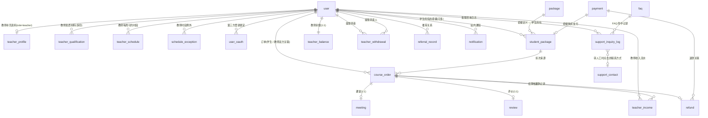

# Mandarly 数据库设计文档

> **状态**:✅ 全部定稿(2026-05-05 完成 7/7 子域)→ DDL 已生成 `server/sql/mysql/mandarly.sql`
> **范围**:仅 `mandarly-module-edu` 业务模块新增表;若依基础表(`system_*` / `infra_*`)沿用框架默认结构,不在本文档重述
> **审核流程**:本目录文档先审,定稿后再生成 `server/sql/mysql/mandarly.sql` DDL
> **后续变更**:上线后所有表结构变更走 `server/sql/mysql/patch/YYYYMMDD_HHmmss_描述.sql` 增量补丁,不再回头改本目录文档(本目录是 v1 设计稿,长效真相在 SQL 文件)

---

## 一、文档结构(按业务子域拆分)

| # | 文档 | 包含表 | 状态 |
|---|------|--------|------|
| 01 | [用户与认证](./01-users-auth.md) | `user` / `user_oauth` / `teacher_profile` / `teacher_qualification` / `teacher_schedule` / `schedule_exception` | ✅ 定稿 v1 |
| 02 | [套餐与订单](./02-packages-orders.md) | `package` / `student_package` / `course_order` / `meeting` / `review` | ✅ 定稿 v1.1 |
| 03 | [支付](./03-payment.md) | `payment` / `refund` / `payment_webhook_event` | ✅ 定稿 v1.1 |
| 04 | [教师收入与提现](./04-teacher-income-withdrawal.md) | `teacher_income` / `teacher_withdrawal` / `teacher_balance` | ✅ 定稿 v1.2 |
| 05 | [推荐码](./05-referral.md) | `referral_record` | ✅ 定稿 v1.1 |
| 06 | [配置与通知](./06-config-notification.md) | `platform_config` / `notification` / `i18n_message` | ✅ 定稿 v1.2 |
| 07 | [客服(v4 新增)](./07-support.md) | `faq` / `support_contact` / `support_inquiry_log` | ✅ Phase 1 + admin §A10/A11/A12 代码完成 |
| 08 | 水平测试与推荐(v4.3 新增)| `level_check_question` / `level_check_option` / `level_check_submission` | ✅ 设计稿 v1 + admin §A13 代码完成;详见 `docs/product/level-check-recommendation-v1.md` |

> **二期不建表**(明确不预留字段,以免架空):`market_pricing` / `student_pause_log` / `teacher_pause_log` / `user.market` 字段。详见 PRD-v4 §4.10 / §4.11。

---

## 二、通用建表约定(全表统一,各子域不再重复)

### 2.1 命名规范

| 项 | 约定 | 示例 |
|---|------|------|
| 表名 | `snake_case`,**业务表无前缀**,沿用 PRD §7 命名 | `user`、`teacher_profile` |
| 关键字避让 | `order` 与 MySQL 关键字冲突,改为 `course_order` | — |
| 字段名 | `snake_case` | `created_at` |
| 主键 | 统一 `id`,`BIGINT UNSIGNED AUTO_INCREMENT` | — |
| 索引名 | 普通 `idx_<字段或语义>` / 唯一 `uk_<字段或语义>` | `idx_user_id` / `uk_email` |
| 外键 | **物理外键不建**,在文档与代码层维护引用关系(若依框架默认做法,生产 InnoDB 性能 + 部署灵活性考量) | — |

### 2.2 通用字段(若依框架强制,所有业务表必含)

| 字段 | 类型 | 默认 | 说明 |
|------|------|------|------|
| `id` | `BIGINT UNSIGNED` | `AUTO_INCREMENT` | 主键 |
| `creator` | `VARCHAR(64)` | `''` | 创建者用户名(若依字段) |
| `create_time` | `DATETIME` | `CURRENT_TIMESTAMP` | 记录创建时间(UTC) |
| `updater` | `VARCHAR(64)` | `''` | 最后更新者(若依字段) |
| `update_time` | `DATETIME` | `CURRENT_TIMESTAMP ON UPDATE CURRENT_TIMESTAMP` | 记录更新时间(UTC) |
| `deleted` | `TINYINT(1)` | `0` | 逻辑删除,0=未删 / 1=已删(若依软删) |
| `tenant_id` | `BIGINT` | `0` | 租户 ID,**Mandarly 一期单租户固定 0**,字段保留供框架查询 |

> **设计稿正文不再列这 7 个字段**,只列业务字段;DDL 生成时统一加。

> ⚠️ **租户拦截器禁用约定**(2026-05-05 优化):
>
> 若依 `TenantContextHolder` + MyBatis 拦截器若启用,会自动给所有查询注入 `WHERE tenant_id = ?`。Mandarly 一期单租户,**必须**在 `application.yaml` 关闭:
> ```yaml
> mandarly:
>   tenant:
>     enable: false
> ```
> `tenant_id` 字段保留只是兼容若依 `BaseDO` 类继承,**业务侧无意义**。开发新业务模块的 Mapper / XML / MyBatis-Plus QueryWrapper 时:
> - **不要**写 `tenant_id` 过滤条件
> - **不要**手动设置 TenantContextHolder
> - 若用 `MPJLambdaWrapper` 多表 join,可能仍会被框架拦截器干预,需在子模块加 `@DS` 或显式 `setTenantIdColumn(null)` —— 联调时验证

### 2.3 类型约定

| 语义 | 类型 | 备注 |
|------|------|------|
| 金额 | `DECIMAL(12,2)` | 后端用 `BigDecimal`,严禁 float / double |
| 币种 | `VARCHAR(8)` | ISO 4217 三位码,如 `HKD` / `USD` / `CNY` |
| 时间(业务时刻) | `DATETIME(3)` | UTC 存储,毫秒精度;前端按用户时区转换 |
| 时间(日期) | `DATE` | 仅日期,无时间 |
| 时间(每日时段)| `TIME` | 教师可约时段用 |
| 状态枚举 | `VARCHAR(32)` | 用字符串而非数字,可读性优先 |
| URL / 文件路径 | `VARCHAR(512)` | COS 直链或 STS 签名 URL |
| 短文本(标题 / 名称) | `VARCHAR(128)` | — |
| 长文本(简介 / 评价)| `VARCHAR(1024)` 或 `TEXT` | 视长度而定 |
| JSON | `JSON` | MySQL 8 原生类型 |
| 布尔 | `TINYINT(1)` | 0=false / 1=true |
| 多语言 i18n key | `VARCHAR(64)` | 关联 `i18n_message.code` |

### 2.4 时区与时间

- **数据库**:`server_time_zone='+00:00'`,所有 `DATETIME` 字段以 UTC 存储
- **应用层**:Spring Boot `spring.jackson.time-zone=UTC` + 用户时区在请求 header / user.timezone 中携带,前端展示时转
- **教师可约时段**(`teacher_schedule`):特例,**用教师本地时区** + 单独 `timezone` 字段记录,后端预约时换算成 UTC 存到 `course_order.scheduled_at`

### 2.5 字符集与排序

- `CHARSET=utf8mb4` `COLLATE=utf8mb4_general_ci`(沿用若依默认)
- 支持 emoji + 阿拉伯语 + 繁中

### 2.6 引擎与表选项

```sql
ENGINE = InnoDB
DEFAULT CHARSET = utf8mb4
COLLATE = utf8mb4_general_ci
COMMENT = '<表用途>'
```

### 2.7 索引原则

- 主键自带聚簇索引
- 外键字段(如 `user_id`、`teacher_id`、`order_id`)**必加索引**(InnoDB 不会自动加,跟 MyISAM 不同)
- 高频查询条件字段加索引(在每张表的「索引」小节明确)
- 唯一约束用 `UNIQUE KEY uk_xxx`
- **避免过度索引**:超过 5 个二级索引的表需在文档说明理由

### 2.8 软删除原则

- 业务逻辑层默认 `WHERE deleted = 0`(MyBatis-Plus 全局配置)
- **唯一索引需含 `deleted` 字段**避免逻辑删除后插入同值冲突
  - 例:`uk_email` → `UNIQUE KEY uk_email_deleted (email, deleted)`

### 2.9 状态机字段

每个有状态的表(订单 / 支付 / 提现 / 审核 等),**必须**:

1. 状态用字符串枚举(可读性优先)
2. 文档里画状态机流转图(Mermaid `stateDiagram-v2`)
3. 状态变更必须走 Service 层方法,**禁止**直接 SQL UPDATE,有审计需求的加状态变更日志表

### 2.10 系统辅助表(运维 / 对账)

业务子域之外,以下系统表参与运维但不属于具体业务子域:

| 表 | 职责 | 归属 | 备注 |
|---|---|---|---|
| `mandarly_patch_log` | 上线增量补丁执行追踪 | server/sql/mysql 工具表 | 沿用 ckkj 模式,字段 `(id, patch_file, executed_at, executor, checksum)` |
| `infra_data_source_log`(若依默认) | 数据变更审计日志 | infra 模块 | 一期不启用,二期合规审计若需要再开 |
| `quartz_*`(若依默认) | 定时任务调度状态 | quartz.sql | 沿用,**不要在业务子域引用** |

**与业务子域的关系**:业务表的对账 Job 写日志可走 `infra_data_source_log` 或自建,不在本目录文档列出。

---

## 三、全局 ER 图(子域间关系)



> 注:`support_contact` 与 `user` 之间**无直接 FK 关系**,运营时按 user.locale / IP 推断 market 在前端选 contact,数据库不存绑定关系。

> **图例**:`||--||` 一对一 / `||--o{` 一对多 / `}o--o{` 多对多 / `o|` 0 或 1。
> 物理外键不建,本图仅展示逻辑引用关系。

---

## 四、设计稿审核流程

1. **本子域文档 lyguanye 自审** → 提交主线
2. **主线人(刘冠业 / project owner代表)审** → 提疑问 / 改动需求
3. **修订** → 二审通过 → 子域状态从「⬜ 待审」改「✅ 已定稿」
4. **全部 7 个子域定稿** → 生成 `server/sql/mysql/mandarly.sql` DDL
5. **DDL 与本设计文档双轨**:DDL 入仓代码,本文档入仓设计;后续变更只改 DDL(走 patch),设计文档冻结作历史

---

## 五、与若依 / vben 框架的衔接

| 表名空间 | 来源 | 处置 |
|---|---|---|
| `system_*`(用户 / 角色 / 菜单 / 字典) | 若依框架自带 | **沿用**,不重述字段;Mandarly `user` 表与 `system_users` 关系另行说明 |
| `infra_*`(代码生成 / 任务 / 文件 / 监控) | 若依框架自带 | **沿用** |
| `bpm_*`(工作流) | 若依框架自带 | 一期不启用,留着不动 |
| `mp_*`(微信公众号) | 若依框架自带 | 一期不启用 |
| 业务表(本文档列出的) | Mandarly 自建 | **新建到 `mandarly-module-edu` 模块** |

> **关键决策**:Mandarly 一期是否复用若依的 `system_users` 表作为 `user` 表?
>
> 第 01 子域「用户与认证」中详细讨论 + 决策,本 README 不预设结论。

---

## 六、待办

- [ ] 完成 7 份子域设计稿
- [ ] 主线审核
- [ ] 定稿后产出 `server/sql/mysql/mandarly.sql` 全量初始化脚本
- [ ] 配套 `server/sql/mysql/quartz.sql`(若依默认)
- [ ] 上线表 `mandarly_patch_log`(沿用 ckkj 模式)
